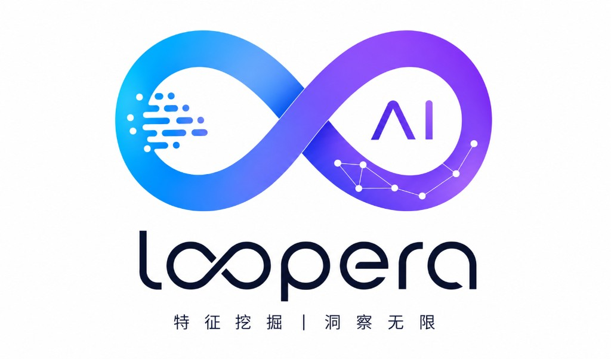
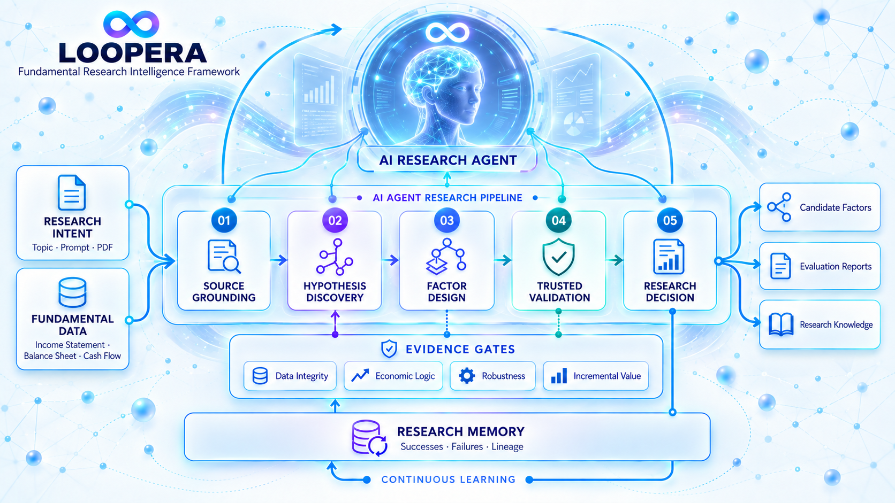
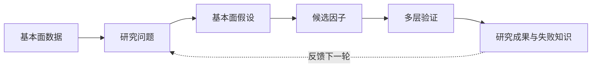
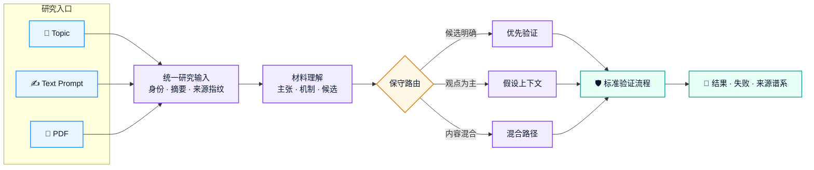
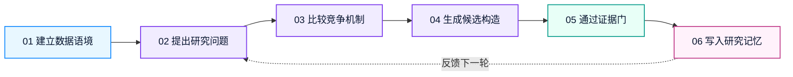
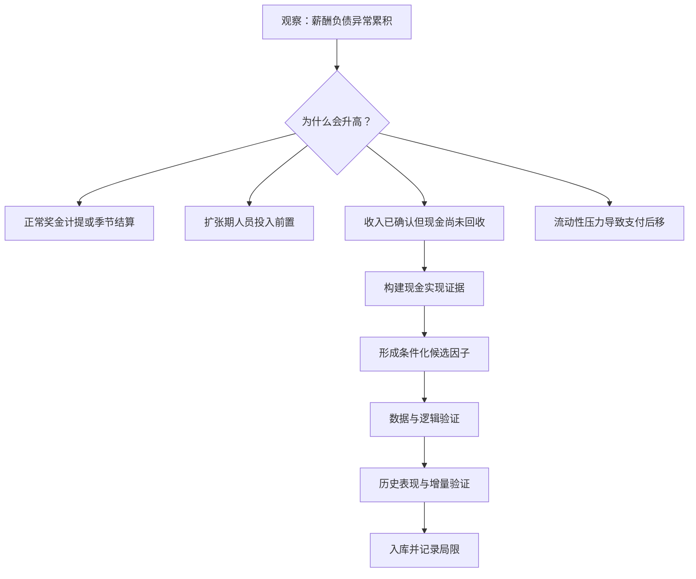

<p align="center">
  
</p>

<h1 align="center">Loopera</h1>

<p align="center">
  <strong>面向基本面因子研究的智能 Agent</strong>
  <br />
  让研究从零散试验，进化为可验证、可追踪、可持续积累的智能工作流。
  <br />
  <sub>Fundamental research, engineered for evidence.</sub>
</p>

<p align="center">
  <a href="https://www.loopera.cn">
    
  </a>
  <a href="./Loopera技术文档.pdf">
    
  </a>
  <a href="#完整案例从财务现象到候选因子">
    
  </a>
</p>

<p align="center">
  
  
  
  
</p>

<p align="center">
  <a href="#产品概览">产品概览</a> ·
  <a href="#产品框架">产品框架</a> ·
  <a href="#pdf--prompt-研究输入框架">研究输入</a> ·
  <a href="#完整案例从财务现象到候选因子">完整案例</a> ·
  <a href="#不是什么">责任边界</a>
</p>

---

## 产品概览

Loopera 围绕上市公司的财务报表与经营信息，为基本面量化团队持续完成**研究方向探索、经济假设形成、候选因子构建、可信验证与知识沉淀**。

### 核心价值

| Research | Validate | Remember | Collaborate |
| --- | --- | --- | --- |
| 从跨报表经营关系中发现值得解释的现象 | 分离研究逻辑与历史表现，逐层筛选候选 | 保存成果、失败原因与研究谱系 | 支持研究员在关键节点审阅、干预和决策 |
| 形成可解释、可检验的基本面假设 | 检查时序、口径、稳定性、重复度与增量价值 | 避免重复试错，持续发现研究空白 | 适配小规模任务与多角色协作研究 |

### 面向谁

- **基本面量化团队**：扩展研究覆盖，建立统一、可复核的因子研究流程；
- **投研与金融科技机构**：把内部报告、研究观点和数据能力连接到标准化验证链路；
- **研究管理者**：追踪研究来源、决策依据、失败原因及后续方向，而不只查看最终回测结果。

<br>

<div align="center">
  
  <br>
  <sub>
    Loopera 将研究输入、基本面数据、假设发现、因子设计、
    可信验证与研究记忆组织成持续学习的 Agent 研究闭环。
  </sub>
</div>

<br>

它的目标不是批量生成公式，也不是用一次漂亮的回测替代研究判断。Loopera 更关心一项研究是否有清晰的基本面逻辑、是否经得住多角度验证，以及它是否为已有研究带来新的信息。

> Loopera 将基本面研究从一次性的人工尝试，组织成持续运行、能够积累和进化的研究流程。

## 为什么从基本面出发

价格反映结果，基本面解释企业如何创造、消耗和重新配置价值。

Loopera 主要围绕企业的盈利质量、现金流、资产负债结构、营运效率、资本投入和经营变化展开研究。相比只观察市场价格，它更关注企业经营中正在发生、但尚未被充分理解或定价的变化。

基本面数据并不简单。不同报表之间需要建立联系，同一个财务数字在不同行业和经营阶段可能有不同含义，公开信息的时间也会影响研究是否真实可用。Loopera 将这些问题纳入统一的研究流程，让 Agent 的工作更接近基本面研究员，而不是通用的数据拟合工具。

## Loopera 能做什么

<p align="center">
  <strong>从经营现象到可信结论，再把每一次研究沉淀为团队知识。</strong>
  <br />
  <sub>Discover → Hypothesize → Build → Validate → Remember → Evolve</sub>
</p>

<table>
  <tr>
    <td width="50%" valign="top">
      <h3>🧭 发现研究方向</h3>
      <p><strong>从经营异常出发，而不是随机组合字段。</strong></p>
      <p>围绕盈利与现金流、资产与产出、负债与经营压力等跨报表关系，寻找值得解释且尚未被充分研究的现象。</p>
    </td>
    <td width="50%" valign="top">
      <h3>🧠 形成基本面假设</h3>
      <p><strong>先解释机制，再构建因子。</strong></p>
      <p>提出可检验的经济解释、竞争机制与失效条件，避免把一次统计相关性直接包装成研究结论。</p>
    </td>
  </tr>
  <tr>
    <td width="50%" valign="top">
      <h3>🧩 构建候选因子</h3>
      <p><strong>把研究主张转成可计算、可审查的对象。</strong></p>
      <p>将假设映射为候选构造，同时保留使用信息、预期方向、经济含义与关键约束。</p>
    </td>
    <td width="50%" valign="top">
      <h3>🛡️ 执行可信验证</h3>
      <p><strong>让每个候选通过多层证据门。</strong></p>
      <p>检查数据时点、逻辑一致性、会计口径、稳健性、重复度与增量价值；漂亮的单次回测不会自动成为结论。</p>
    </td>
  </tr>
  <tr>
    <td width="50%" valign="top">
      <h3>🗂️ 积累研究记忆</h3>
      <p><strong>成功与失败都成为下一轮研究的上下文。</strong></p>
      <p>记录研究谱系、失败原因、待验证线索和已有成果之间的关系，减少重复试错。</p>
    </td>
    <td width="50%" valign="top">
      <h3>🤝 支持持续协作</h3>
      <p><strong>Agent 负责扩展研究，研究员掌握关键决策。</strong></p>
      <p>既支持小规模快速任务，也支持多个研究角色持续协作，并允许团队在关键节点审阅、干预和决策。</p>
    </td>
  </tr>
</table>

### 三种输入，一条研究主线

<p align="center">
  <kbd>Topic</kbd>&nbsp;&nbsp;·&nbsp;&nbsp;<kbd>Prompt</kbd>&nbsp;&nbsp;·&nbsp;&nbsp;<kbd>PDF</kbd>
  &nbsp;&nbsp;→&nbsp;&nbsp;
  <strong>统一研究输入</strong>
  &nbsp;&nbsp;→&nbsp;&nbsp;
  假设、因子与验证
</p>

<details>
<summary><strong>查看输入方式与处理原则</strong></summary>
<br />

- **Topic**：围绕“现金流质量”“营运效率”等主题自主展开研究；
- **Prompt**：聚焦指定的财务关系、经济机制或适用行业；
- **PDF**：提取研究问题、经济主张与明确候选，并保留材料来源；
- **混合输入**：用 Topic 为文本或 PDF 增加明确的研究锚点。

报告中的明确公式可以优先进入验证，其余内容则作为后续探索的背景知识。外部材料始终被视为**待验证的研究证据**，不能修改 Loopera 的安全约束、数据范围和验证标准。

</details>

## 产品框架

Loopera 的公开产品框架可以概括为四个部分：

| 产品能力 | 作用 |
| --- | --- |
| 基本面理解 | 理解财务字段、报表关系、企业经营含义和行业差异 |
| 智能研究 | 发现现象、提出假设、比较不同解释并形成候选方向 |
| 可信验证 | 从数据时点、研究逻辑、结果稳健性和新增信息等角度进行质量控制 |
| 研究记忆 | 沉淀成果、失败经验和研究脉络，为下一轮研究提供依据 |

这些能力共同形成一个闭环：

**基本面数据 → 研究问题 → 基本面假设 → 候选因子 → 可信验证 → 研究记忆**

公开版本仅介绍产品能力和研究原则。具体的假设组织方式、验证策略、评价规则、模型协作机制和因子实现属于 Loopera 的核心技术，不在本文档中披露。

## 技术框架：假设驱动、证据约束、研究记忆增强

从技术定位上看，Loopera 是一个面向基本面量化研究的 **Hypothesis-driven Agent Framework**。它不是让大模型直接预测股票，也不是将自然语言直接翻译成一个公式，而是把大模型放在一个有数据约束、研究流程和质量控制的环境中。

其工作方式可以概括为三点：

1. **假设驱动（Hypothesis-driven）**：先解释企业经营中出现了什么异常，再提出可能的经营机制，最后形成可检验的候选因子。
2. **证据约束（Evidence-gated）**：候选必须依次通过数据、逻辑、经济含义和统计表现等检查；任一关键问题都可以终止该候选。
3. **记忆增强（Memory-augmented）**：成功、失败、相似构造和未完成的研究线索都会被保存，成为后续研究的上下文。



这一 Framework 的关键并不是某一个模型，而是围绕模型建立的完整研究环境：模型负责提出、解释和改进想法，确定性的程序负责数据计算与客观检查，研究记忆负责让整个系统持续进化。

## 系统模块

系统能力可以按职责分为九个模块。下表只描述模块边界，不披露内部评价规则和核心策略。

| 模块 | 对应能力 | 主要输出 |
| --- | --- | --- |
| 研究输入与材料理解 | 接收 Topic、文本 Prompt 或 PDF，将外部材料转成统一、可追踪的研究输入 | 材料摘要、观点清单、候选公式目录、来源信息 |
| 数据与字段系统 | 统一三张财务报表的字段含义、数据版本和公开时间，构建研究可用的基本面面板 | 标准化基本面数据、字段目录、数据质量信息 |
| Agent 编排 | 支持单 Agent 任务和多研究角色协作，控制一次研究如何提出、执行和结束 | 研究轮次、角色意见、任务状态 |
| 假设研究 | 从不同基本面视角提出研究方向，并把一个现象拆成若干可以比较的解释 | 研究主题、经营机制、可观察证据、失效条件 |
| 因子构建 | 将研究假设转换为能够在财务面板上计算的候选因子 | 候选构造、使用字段、预期方向、经济解释 |
| 可信验证 | 检查数据使用、计算稳定性、时序有效性、会计口径、逻辑一致性和重复度 | 每一项检查的结论与拒绝原因 |
| 回测与增量评估 | 在统一研究口径下评价候选表现，并判断其是否提供已有因子之外的信息 | IC、分组表现、覆盖率、稳定性和增量性摘要 |
| 研究记忆与规划 | 保存研究谱系、失败经验、主题拥挤度和未验证线索，规划后续研究 | 方向看板、失败知识、研究缺口、下一步建议 |
| 轨迹与报告 | 将一次运行的输入、推理、候选、检查结果和最终结论组织成可阅读报告 | 研究卡片、运行轨迹、候选漏斗、成果报告 |

在系统实现层面，这些职责分别由数据与面板、Agent 与协作、Pipeline 与 Harness、回测、存储与记忆、轨迹与报告等组件承载。模块之间通过结构化研究对象连接，因此可以单独升级模型、数据源或评价组件，而不需要重写整个研究流程。

## PDF / Prompt 研究输入框架

<p align="center">
  <strong>不同形式的研究材料，进入同一条可验证、可追踪的研究主线。</strong>
  <br />
  <sub>Bring your question, your thesis, or an entire research report.</sub>
</p>

### 研究入口

<table>
  <tr>
    <td width="33%" align="center" valign="top">
      <h3>🎯 Topic</h3>
      <p><strong>给出一个研究方向</strong></p>
      <p>围绕现金流质量、营运效率等主题，由 Agent 自主展开探索。</p>
    </td>
    <td width="34%" align="center" valign="top">
      <h3>✍️ Prompt</h3>
      <p><strong>表达一项研究意图</strong></p>
      <p>聚焦指定的财务关系、经济机制、行业范围或验证重点。</p>
    </td>
    <td width="33%" align="center" valign="top">
      <h3>📄 PDF</h3>
      <p><strong>导入已有研究材料</strong></p>
      <p>提取报告中的问题、主张、公式与约束，并保留完整来源信息。</p>
    </td>
  </tr>
</table>

### 从材料到研究证据


### 四个处理阶段

<table>
  <tr>
    <td width="50%" valign="top">
      <h3>① 🧬 统一输入</h3>
      <p><strong>所有材料先获得稳定身份。</strong></p>
      <p>系统保存材料类型、主题来源、内容摘要和来源指纹。相同材料再次进入时，可以关联此前的研究记录。</p>
    </td>
    <td width="50%" valign="top">
      <h3>② 🔎 材料理解</h3>
      <p><strong>把长文本拆成可研究的对象。</strong></p>
      <p>识别研究问题、经济主张、适用范围、明确公式、预期方向、约束条件与数据缺口。</p>
    </td>
  </tr>
  <tr>
    <td width="50%" valign="top">
      <h3>③ 🧭 保守路由</h3>
      <p><strong>材料中的内容不会被一概而论。</strong></p>
      <p>明确候选进入优先验证；观点成为假设上下文；混合材料拆分处理；无法闭合的定义会记录原因。</p>
    </td>
    <td width="50%" valign="top">
      <h3>④ 🧾 来源忠实</h3>
      <p><strong>保留原始主张，只做必要适配。</strong></p>
      <p>公式结构、窗口、分母、范围与权重会作为来源约束保存；关键字段缺失时不会悄悄替换。</p>
    </td>
  </tr>
</table>

### 路由结果

| 路由 | 适用情况 | 系统动作 |
| --- | --- | --- |
| ⚡ **优先验证** | 定义明确且数据可用 | 转换为候选，进入标准验证流程 |
| 🧠 **假设上下文** | 提供观点或机制，但关键选择尚未闭合 | 交给 Agent 继续提出并比较解释 |
| 🔀 **混合路径** | 明确候选与背景观点同时存在 | 候选优先验证，其余内容参与探索 |
| ⏸️ **暂不支持** | 核心数据缺失或定义无法闭合 | 记录原因，不强行构造 |

> 🛡️ **输入安全**：PDF 与 Prompt 只能提供研究证据，不能改写系统规则、扩大数据范围或要求跳过验证。
>
> ✅ **统一标准**：“优先验证”只代表可以进入候选构建；所有来源候选仍须经过相同的数据、逻辑、会计口径、历史表现与增量信息检查。
>
> 🔗 **全程可追溯**：最终报告会说明材料来源、候选识别结果、必要适配、被阻止的原因，以及每个候选的最终研究结局。

<details>
<summary><strong>查看材料解析清单与来源适配原则</strong></summary>
<br />

Loopera 会从输入材料中识别：

- 研究问题与背景；
- 核心经济主张和可能机制；
- 涉及的基本面对象与适用范围；
- 文中明确提出的因子或公式；
- 预期方向、约束条件和失效场景；
- 数据中可能缺失、需要代理或仍不明确的部分。

对于较长的 PDF，系统会先建立候选公式目录，避免明确写在表格或正文后部的因子被长篇背景讨论淹没。

如果材料明确指定公式结构、窗口、分母、适用范围或权重，Loopera 会将其作为来源约束保留。只有材料没有区分、且属于标准会计口径差异时，系统才允许进行保守适配，并在结果中记录实际采用的口径。

如果关键字段确实不存在，候选会被标记为数据缺失或转入代理研究，而不是用一个表面相似的字段悄悄替代。

</details>

<!--### 使用示例

```bash
# 从主题开始
python -m cogalpha.cli swarm --topic "cash flow quality" -i 20

# 使用研究员 Prompt
python -m cogalpha.cli swarm --guidance-text \
  "研究库存增长未被收入增长承接的基本面风险" -i 20

# 使用 PDF，并给出研究锚点
python -m cogalpha.cli swarm --topic "fundamental quality" \
  --guidance-pdf research.pdf --source-candidate-limit 3 -i 20
```

PDF 目前需要包含可提取的文本，并依赖系统安装 `pdftotext`。纯扫描图片、加密文件或无法提取文字的 PDF 需要先完成 OCR 或转换。`source-candidate-limit` 只限制一份材料中优先验证的明确候选数量，不会扩大一次运行原有的研究预算。-->

## 一次研究如何运行

<p align="center">
  <strong>一轮研究不是“生成公式 + 查看回测”，而是一条由证据推动的决策链。</strong>
  <br />
  <sub>Context → Question → Mechanisms → Candidate → Evidence Gates → Memory</sub>
</p>

### 六阶段研究闭环



<table>
  <tr>
    <td width="50%" valign="top">
      <h3>① 🧱 建立数据语境</h3>
      <p><strong>先限定 Agent 在当时能够看到什么。</strong></p>
      <p>确定财务字段、数据版本、行业信息与研究区间，并按实际公开时间组织数据，避免未来信息进入更早的判断。</p>
    </td>
    <td width="50%" valign="top">
      <h3>② 🔭 提出研究问题</h3>
      <p><strong>从值得解释的经营异常开始。</strong></p>
      <p>例如利润为何没有转化为现金、经营负债为何偏离企业规模、资本投入为何没有形成相应资产，而不是随机组合字段。</p>
    </td>
  </tr>
  <tr>
    <td width="50%" valign="top">
      <h3>③ 🧠 比较竞争机制</h3>
      <p><strong>一个现象，不预设唯一叙事。</strong></p>
      <p>保留正常结算、主动扩张、回款放缓或流动性压力等合理解释；只有能被财务证据区分的机制才继续推进。</p>
    </td>
    <td width="50%" valign="top">
      <h3>④ 🧩 生成候选构造</h3>
      <p><strong>把假设变成可计算、可审查的研究契约。</strong></p>
      <p>候选同时声明使用信息、经济含义、预期方向与失效场景，后续不仅评价数值，也检查实现是否忠于原始主张。</p>
    </td>
  </tr>
  <tr>
    <td width="50%" valign="top">
      <h3>⑤ 🛡️ 逐层验证</h3>
      <p><strong>低成本检查在前，完整评价在后。</strong></p>
      <p>数据、时序、会计口径、逻辑、新颖性与历史证据构成连续关卡；任何关键问题都可以终止候选。</p>
    </td>
    <td width="50%" valign="top">
      <h3>⑥ 🗂️ 保存并继续研究</h3>
      <p><strong>结果和失败都会进入研究记忆。</strong></p>
      <p>通过的候选进入研究库；未通过的候选保存停止位置与原因，为深化方向、避免重复试错或主动转向提供依据。</p>
    </td>
  </tr>
</table>

### Evidence Gates

| 证据门 | 核心问题 | 可能结果 |
| --- | --- | --- |
| ⚙️ **执行与覆盖** | 代码能否稳定计算，数据覆盖是否足够？ | 继续 / 修复 / 停止 |
| ⏱️ **信息时点** | 财务信息在研究时点是否真实可见？ | 通过 / 拒绝 |
| 🧾 **会计口径** | 存量、流量、累计值与同行比较是否合理？ | 通过 / 修订 |
| 🧠 **逻辑一致性** | 经济解释、实现方式和预期方向是否一致？ | 通过 / 退回 |
| 🧬 **研究新颖性** | 候选是否只是已有结果的重复或轻微变体？ | 保留 / 去重 |
| 📈 **表现与增量** | 历史证据是否具备基本质量，并提供新增信息？ | 入库 / 停止 |

> **每个结论都带着证据离开流水线。** Loopera 保存候选为何被提出、通过了哪些检查、在哪里停止，以及下一轮研究应继续追问什么。

## Agent 实际输出什么

Loopera 的最小交付单位不是“因子名称 + 一条回测曲线”，而是一份结构化的研究记录。根据现有运行产物，一份完整输出通常包含：

| 输出内容 | 它回答的问题 |
| --- | --- |
| 基本面现象 | 企业经营或财务关系中，究竟观察到了什么异常？ |
| 研究假设 | 这个异常为什么可能与未来经营或定价有关？ |
| 竞争机制 | 除了当前解释，还有哪些合理原因可能产生同样现象？ |
| 可观察证据 | 哪些跨报表或跨期信息能够支持、削弱或否定某个解释？ |
| 候选描述 | 因子表达的风险或质量含义是什么，预期方向是什么？ |
| 质量记录 | 数据、逻辑、会计口径和研究一致性是否通过检查？ |
| 评估摘要 | 候选的相关性、分组特征、覆盖范围和增量信息如何？ |
| 谱系与下一步 | 它与已有研究有什么关系，还留下哪些值得测试的问题？ |

## 完整案例：从财务现象到候选因子

下面选择一条真实进入研究库的结果，展示 Loopera 如何完成一次基本面因子挖掘。案例中的研究逻辑与统计结果来自 Agent 的实际输出；为保护核心技术，精确字段组合、时间窗口、权重函数、异常值处理和内部判定参数均不公开。

### 案例背景

研究主题是：**薪酬负债异常是否包含尚未被市场充分理解的现金结算压力？**

这里的薪酬负债，是企业已经确认、但尚未完成现金支付的工资、奖金、福利等员工相关义务。它位于资产负债表，而收入和成本来自利润表，现金支付与销售收现来自现金流量表。因此，这个问题天然需要跨报表研究。

单看薪酬负债高低没有充分意义：大型企业的绝对金额自然更高，年末奖金计提会产生季节波动，快速扩张的公司也可能先招聘、后形成收入。真正值得研究的是，**薪酬负债是否超出了企业经营规模、行业特征和正常结算节奏能够解释的范围**。



### 第一步：发现一个值得解释的现象

在更早的一轮研究中，Agent 已发现“薪酬负债相对正常经营规模的偏离”具有初步信号。但这个结果只能说明某种偏离可能有信息，不能说明信息来自哪里。

Loopera 没有继续机械地更换规模指标，而是把下一轮任务改成：**解释已有信号**。也就是说，研究重点从“再造一个相似比率”转为“为什么这个偏离会与未来表现相关”。

这一步输出的不是代码，而是一张研究问题卡：

| 项目 | Agent 输出的含义 |
| --- | --- |
| 观察现象 | 员工相关经营负债相对收入与同行常态偏高 |
| 正常状态 | 负债随经营规模和季节结算变化，并在后续支付期回落 |
| 待解释偏离 | 偏高部分不能被规模、奖金周期或正常扩张完全解释 |
| 研究问题 | 偏离是否代表未来现金支付、融资或盈利质量压力？ |
| 预期方向 | 若偏离确实代表未被吸收的支付压力，未来表现应相对较弱 |

### 第二步：提出竞争机制

Agent 随后提出多种都能解释“薪酬负债偏高”的机制。这样做是为了防止看到一个数字后直接给出唯一叙事。

| 竞争机制 | 基本面解释 | 应观察到的辅助证据 |
| --- | --- | --- |
| 现金周转压力 | 企业缺乏足够经营现金，员工相关支付被动后移 | 收现能力、现金缓冲或融资压力同步恶化 |
| 盈利驱动的奖金计提 | 盈利改善带来绩效奖金和利润分享计提 | 盈利先改善，负债具有季节性并在支付后回落 |
| 收入确认领先于现金回收 | 收入已经入账，但客户付款速度变慢 | 收入与销售现金流入之间出现缺口 |
| 产能建设与人员前置 | 企业先投入厂房、设备和人员，收入尚未完全释放 | 资本投入与在建资产同步上升，后续经营规模扩大 |

这些机制可能同时发生。Loopera 的目标不是声称从三张报表中可以精确识别企业是否拖欠工资，而是寻找能够提高或降低某种解释可信度的公开证据。

### 第三步：选择可以验证的机制

在这次具体研究中，Agent 选择检验“收入确认领先于现金回收”这一机制。

原因是利润表记录的收入与现金流量表记录的销售现金流入，可以从两个角度描述同一经营过程。如果收入仍然存在，但相应现金流入偏弱，薪酬负债的异常累积就更可能与现金实现压力有关，而不只是企业规模变大。

候选因子的公开概念表达为：

> **经营规模无法解释的薪酬负债偏离 × 收入现金化压力**

这只是经济含义示意，不是生产公式。实际构造还包含时间对齐、报表口径转换、行业可比性、缺失值处理和稳健化步骤，相关实现属于 Loopera 的核心研究技术。

### 第四步：把假设转成可计算候选

Factor Builder 将假设转换为候选计算，并同时提交四类声明：

- **使用信息**：来自资产负债表、利润表和现金流量表的公开财务信息；
- **经济含义**：识别正常经营关系之外、且伴随现金实现不足的薪酬负债异常；
- **预期方向**：压力越明显，未来经营与市场表现越可能承压；
- **失效场景**：奖金季节性、预收款、结算时点、商业模式差异和主动扩张都可能造成误判。

系统要求代码实现与这四类声明绑定。这样即使一个候选历史表现不错，只要代码实际测量的是另一件事，也会被拒绝或要求改写研究主张。

### 第五步：验证数据和实现

该候选首先通过了执行与数据层检查：

- 生成了约 15.6 万个有效财务观测；
- 日频研究面板平均覆盖约 3,020 家公司，约占当时可交易研究域的 76%；
- 在多个历史信息截面上进行超过 120 万次一致性比较，没有发现未来信息改变历史结果的情况；
- 与已有尝试相比，它引入了新的跨报表机制信息，而不是只替换一个分母；
- 存量负债、期间收入和累计现金流分别按适合的财务口径处理。

这里的价值在于：Agent 写出的代码即使能够运行，也不会因此直接进入回测结论。数据是否当时可见、报表口径是否可比、结果是否有足够覆盖，都是独立问题。

### 第六步：在不知道回测成绩的情况下审查经济逻辑

在完整表现评估之前，独立审查角色只读取研究假设、字段含义和候选实现，不读取回测收益。该候选的经济逻辑审查得分为 **73/100**，结论是可以继续，但必须保留以下意见：

- 销售现金流入相对收入偏低，更准确的表述是“现金实现不足”，不能直接等同于客户回款违约；
- 薪酬负债具有奖金计提和支付季节性，同行比较只能缓解、不能完全消除这个问题；
- 行业分类不一定等同于相同商业模式，同行基准仍可能不够精细；
- 单期现金实现指标会受到预收款、跨期结算和较小分母的影响；
- 当前证据支持“风险状态识别”，但不足以对企业的具体支付行为作事实判断。

这部分输出很重要：Loopera 不只是替一个通过的候选寻找正面叙事，也会把它最可能被误解的地方写入最终研究记录。

### 第七步：评估历史表现与新增信息

候选通过逻辑审查后，才进入完整研究评估。当前内部全样本结果如下：

| 指标 | 结果 | 如何理解 |
| --- | ---: | --- |
| Rank IC 均值 | 0.0038 | 候选排序与后续收益之间存在较弱但持续的横截面关系 |
| IC 胜率 | 56.2% | 超过一半的观察期方向一致 |
| 多空年化收益 | 3.64% | 研究组合两端在历史窗口中的年化差异 |
| 多空 Sharpe | 0.85 | 历史收益与波动的比例 |
| 最大回撤 | -9.69% | 研究组合历史上出现过的最大累计回撤 |
| 分组单调性 | 0.893 | 从低暴露到高暴露的分组表现具有较清晰顺序 |
| 平均回测覆盖率 | 67.1% | 候选能覆盖研究域中的相当一部分公司 |
| 中性化后 IC | 0.0043 | 控制常见风险暴露后仍保留一定信息 |
| 增量残差 IC | 0.0027 | 剔除已有因子解释后仍存在新增信息 |

最终，候选通过了该轮研究所要求的全部检查并进入研究库。

需要特别强调：以上都是内部全样本研究指标，并非独立样本外结果。它们说明该假设值得进入下一阶段研究，不代表未来收益、实盘表现或可直接交易的 Alpha。

### 第八步：同一家族中的其他候选发生了什么

这个研究家族总共留下 7 次相关尝试，其中 2 个进入研究库，另外 5 个分别在不同阶段停止：

- 第一版基础构造因研究表述与实现不够一致而被退回，修订后才通过；
- 一项试图排除扩张影响的变体在早期数据表现上没有获得支持；
- 一项改写版本虽然有初步表现，但未能证明相对已有结果的增量价值；
- 另外的流动性条件化版本没有提供足够证据。

这说明 Loopera 不是因为确认了一个主题，就接受该主题下的所有公式。每个分支都需要独立回答：它究竟检验了哪个机制、是否保留了原假设、是否比基础结果增加了信息。

### 第九步：写入研究记忆

入库之后，系统保存的不只是因子面板，还包括：

- 该候选来自哪个现象和哪条机制分支；
- 哪些兄弟构造已失败，以及失败发生在哪一类问题；
- 审查角色提出的季节性、代理变量和同行可比性风险；
- 该方向已经较为拥挤，需要转向新主题还是继续补充关键证据；
- 下一阶段应进行的样本外、稳定性和更细粒度基本面验证。

下一次 Agent 研究相近主题时，这些内容会重新进入上下文，避免从同一个简单比率重新开始。

### 最终如何解读这个案例

这条结果支持的是一个有限结论：**当员工相关经营负债明显偏离正常经营关系，并同时出现收入现金实现压力时，该组合状态在历史样本中包含一定的增量信息。**

它不支持更强的表述，例如“可以从公开财报确认企业拖欠工资”或“该因子已经具有样本外盈利能力”。对 Loopera 来说，好的研究输出必须同时写清楚证据支持到哪里、不能支持什么，以及下一步需要什么验证。

这个案例展示了 Loopera 的完整交付：一条研究问题、多个竞争机制、一项可执行候选、一组逐层验证证据、一份带限制条件的结果解释，以及可被下一轮继续使用的研究记忆。

## 核心特点

### 基本面优先

研究从企业经营和财务关系出发，而不是先观察价格结果再补充解释。系统重点处理资产负债表、利润表和现金流量表之间的联系。

### 研究逻辑与结果分开评价

Loopera 会分别判断“这个基本面解释是否合理”和“历史数据是否支持它”，降低因为结果好看而反向包装叙事的风险。

### 关注新增信息

一个候选即使表现良好，如果只是已有因子的近似版本，也不应被当成新的研究成果。Loopera 会关注候选是否带来了新的基本面解释或信息来源。

### 全过程可追溯

每项研究都有来源、过程和结论。团队可以了解一个方向为何被提出、经过了哪些验证、为什么保留或放弃。

### 从失败中学习

失败不是被丢弃的日志，而是研究资产。Loopera 会利用历史失败减少重复试错，并帮助团队识别长期没有被覆盖的研究区域。

### 人机协同

Loopera 为研究员扩展探索范围、执行重复验证并整理证据；最终判断仍由具备专业背景的研究团队完成。

## 当前研究产出

以下统计来自仓库中保存的一组内部研究运行快照，目的是说明 Framework 实际产生了什么，而不是展示可直接交易的信号。

### 研究规模

| 项目 | 当前记录 |
| --- | ---: |
| 候选尝试 | 147 |
| 结构化基本面假设 | 66 |
| 归纳出的研究模式 | 37 |
| 进入研究库的候选 | 5 |

147 次尝试中，5 个候选进入研究库，125 个被明确拒绝，17 个因执行或生成问题没有形成有效候选。约三分之二的尝试在经济逻辑审查或早期表现筛选阶段停止，说明系统的主要工作不是“尽可能多地入库”，而是在前期淘汰缺少解释力或证据不足的想法。

| 主要停止位置 | 尝试数 | 说明 |
| --- | ---: | --- |
| 研究逻辑与经济一致性 | 52 | 叙事与实现不一致、代理解释过强、方向或会计含义存在问题 |
| 早期信号筛选 | 45 | 基础历史证据不足，不继续消耗完整评价成本 |
| 数据覆盖与面板质量 | 11 | 可用公司过少、结果缺少横截面区分度或数据状态不稳定 |
| 与历史研究重复 | 9 | 与已有尝试过于接近，没有形成实质性新增信息 |
| 完整表现与增量评价 | 7 | 有初步信号，但没有达到最终质量或新增信息要求 |
| 执行与时序检查 | 3 | 计算失败、不稳定或数据使用时间不符合要求 |

### 研究覆盖了哪些基本面问题

Agent 实际探索过的主题并不限于已入库结果，主要包括：

- 经营负债和薪酬结算压力
- 利润向经营现金流的转换质量
- 客户回款、库存和营运资金占用
- 资本开支与资产形成之间的匹配关系
- 管理费用与业务扩张是否匹配
- 预付款和其他应收款的异常占用
- 供应商信用与采购结算变化
- 投资收益的可持续性

这些主题共同体现了 Loopera 的基本面取向：研究对象不是孤立的财务比率，而是不同报表之间本应成立、却可能发生偏离的经营关系。

### 挖出了什么样的候选结果

当前 5 个入库候选集中在“经营负债异常”这条研究主线。这种集中既说明 Agent 找到了可以继续深化的基本面现象，也说明现阶段研究多样性仍然有限。

从经济含义看，这些候选大致分为两类：

1. **异常负担类**：判断某项经营负债是否明显超出收入、成本或同行经营状态能够解释的正常范围。
2. **机制区分类**：进一步结合现金实现和资本投入等跨报表证据，区分正常扩张或结算节奏与潜在现金压力。

为避免公开核心构造，本文不列出字段组合和公式。仅就聚合研究特征而言，这 5 个候选在当前内部全样本研究中的表现范围如下：

| 研究指标 | 观察区间 |
| --- | ---: |
| Rank IC 绝对值 | 0.0035–0.0065 |
| 多空年化收益绝对值 | 2.54%–6.12% |
| 多空 Sharpe 绝对值 | 0.55–0.98 |
| 分组单调性绝对值 | 0.81–0.94 |
| 平均覆盖率 | 51.9%–82.0% |

这些数字用于说明输出形态，不应被理解为样本外业绩或产品收益。现有入库判定基于内部研究窗口，尚未构成独立样本外验证、实盘验证或投资建议。

### 对 Agent 能力的独立评估

为了不只依赖真实市场中无法确认真相的历史结果，我们还建立了答案已知的模拟研究环境，对 Agent 的发现能力与误发现风险进行独立评估。当前得到的结论是：

- Loopera 能识别部分传统线性基本面信息，说明数据理解、假设生成、因子构建和评价链路已经连通。
- 在模拟的无信号环境中，单一统计检验仍会出现偶然显著；完整验证流程过滤了这批最终候选，证明多层验证是必要的。
- Agent 对交互、状态依赖和其他复杂非线性基本面关系的自主发现能力仍然不足。
- Agent 容易受提示中的例子和常见表达影响，因此“会生成某种形式”不等于“独立发现了这种规律”。
- 更多数据和更多尝试并不会自动带来更真实的发现，停止规则、研究多样性和独立评测同样重要。

综合真实运行与模拟实验，Loopera 已经是一套可运行、可验证、可积累的基本面研究 Framework；它目前最明确的价值是扩大研究覆盖、规范研究过程并保存可复核证据，而不是承诺自动发现稳定 Alpha。

## 适用场景

- 基本面量化团队的研究方向扩展
- 财务因子创意生成与初步验证
- 已有因子库的重复度和增量价值检查
- 财务研究流程的标准化与留痕
- 新研究员的基本面研究辅助
- Agent 研究能力的受控评测

## 不是什么

Loopera 不是投资建议系统，不承诺收益，也不替代数据授权、合规审查和投资决策。

它不会把语言模型生成的内容直接当成事实，也不会把一次历史显著结果直接定义为有效因子。所有输出都应在正式使用前经过独立研究与风险评估。

## 公开范围

本仓库可以公开产品框架、通用代码、使用说明和聚合实验结论。以下内容不属于公开范围：

- 未经授权的原始数据和数据快照
- 候选因子的具体实现与交易使用方式
- 内部评价规则、参数配置和研究策略
- 专有的 Agent 协作、假设演化与验证机制细节
- 密钥、服务配置和包含敏感上下文的运行记录

---

<h2 align="center">让基本面研究形成可持续的复利</h2>

<p align="center">
  了解 Loopera 的产品能力、技术框架与研究方法。
</p>

<p align="center">
  <a href="https://www.loopera.cn">
    
  </a>
  <a href="./Loopera技术文档.pdf">
    
  </a>
</p>

<p align="center">
  <sub>Loopera 用于研究与技术评估，不构成任何投资建议，也不承诺未来收益。</sub>
</p>
