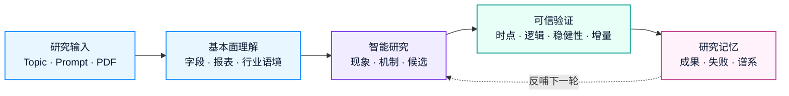
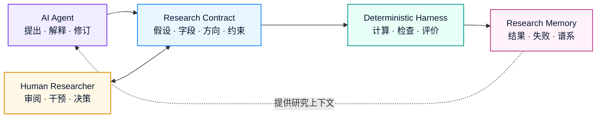
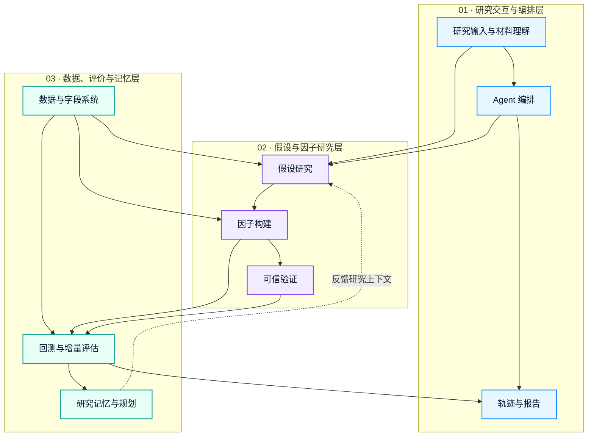
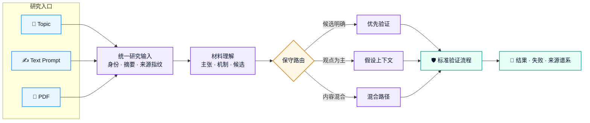
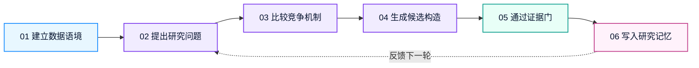
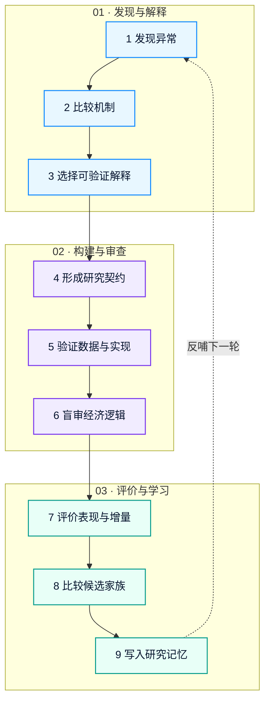
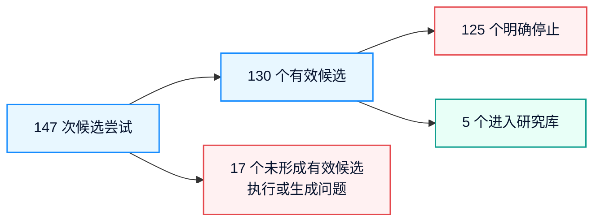

<p align="center">
  
</p>

<h1 align="center">Loopera</h1>

<p align="center">
  <strong>面向基本面因子研究的智能 Agent</strong>
  <br />
  让研究从零散试验，进化为可验证、可追踪、可持续积累的智能工作流。
  <br />
  <sub>Fundamental research, engineered for evidence.</sub>
</p>

<p align="center">
  <a href="https://www.loopera.cn">
    
  </a>
  <a href="./docs/Loopera技术文档.pdf">
    
  </a>
  <a href="#完整案例从财务现象到候选因子">
    
  </a>
</p>

<p align="center">
  
  
  
  
</p>

<p align="center">
  <a href="#产品概览">产品概览</a> ·
  <a href="#产品框架">产品框架</a> ·
  <a href="#pdf--prompt-研究输入框架">研究输入</a> ·
  <a href="#完整案例从财务现象到候选因子">完整案例</a> ·
  <a href="#不是什么">责任边界</a>
</p>

---

## 产品概览

Loopera 围绕上市公司的财务报表与经营信息，为基本面量化团队持续完成**研究方向探索、经济假设形成、候选因子构建、可信验证与知识沉淀**。

### 核心价值

| Research | Validate | Remember | Collaborate |
| --- | --- | --- | --- |
| 从跨报表经营关系中发现值得解释的现象 | 分离研究逻辑与历史表现，逐层筛选候选 | 保存成果、失败原因与研究谱系 | 支持研究员在关键节点审阅、干预和决策 |
| 形成可解释、可检验的基本面假设 | 检查时序、口径、稳定性、重复度与增量价值 | 避免重复试错，持续发现研究空白 | 适配小规模任务与多角色协作研究 |

### 我们面向谁

- **基本面量化团队**：扩展研究覆盖，建立统一、可复核的因子研究流程；
- **投研与金融科技机构**：把内部报告、研究观点和数据能力连接到标准化验证链路；
- **研究管理者**：追踪研究来源、决策依据、失败原因及后续方向，而不只查看最终回测结果。

<br>

<div align="center">
  
  <br>
  <sub>
    Loopera 将研究输入、基本面数据、假设发现、因子设计、
    可信验证与研究记忆组织成持续学习的 Agent 研究闭环。
  </sub>
</div>

<br>

它的目标不是批量生成公式，也不是用一次漂亮的回测替代研究判断。Loopera 更关心一项研究是否有清晰的基本面逻辑、是否经得住多角度验证，以及它是否为已有研究带来新的信息。

> Loopera 将基本面研究从一次性的人工尝试，组织成持续运行、能够积累和进化的研究流程。

## 为什么从基本面出发

价格反映结果，基本面解释企业如何创造、消耗和重新配置价值。

Loopera 主要围绕企业的盈利质量、现金流、资产负债结构、营运效率、资本投入和经营变化展开研究。相比只观察市场价格，它更关注企业经营中正在发生、但尚未被充分理解或定价的变化。

基本面数据并不简单。不同报表之间需要建立联系，同一个财务数字在不同行业和经营阶段可能有不同含义，公开信息的时间也会影响研究是否真实可用。Loopera 将这些问题纳入统一的研究流程，让 Agent 的工作更接近基本面研究员，而不是通用的数据拟合工具。

## Loopera 能做什么

<p align="center">
  <strong>从经营现象到可信结论，再把每一次研究沉淀为团队知识。</strong>
  <br />
  <sub>Discover → Hypothesize → Build → Validate → Remember → Evolve</sub>
</p>

<table>
  <tr>
    <td width="50%" valign="top">
      <h3>🧭 发现研究方向</h3>
      <p><strong>从经营异常出发，而不是随机组合字段。</strong></p>
      <p>围绕盈利与现金流、资产与产出、负债与经营压力等跨报表关系，寻找值得解释且尚未被充分研究的现象。</p>
    </td>
    <td width="50%" valign="top">
      <h3>🧠 形成基本面假设</h3>
      <p><strong>先解释机制，再构建因子。</strong></p>
      <p>提出可检验的经济解释、竞争机制与失效条件，避免把一次统计相关性直接包装成研究结论。</p>
    </td>
  </tr>
  <tr>
    <td width="50%" valign="top">
      <h3>🧩 构建候选因子</h3>
      <p><strong>把研究主张转成可计算、可审查的对象。</strong></p>
      <p>将假设映射为候选构造，同时保留使用信息、预期方向、经济含义与关键约束。</p>
    </td>
    <td width="50%" valign="top">
      <h3>🛡️ 执行可信验证</h3>
      <p><strong>让每个候选通过多层证据门。</strong></p>
      <p>检查数据时点、逻辑一致性、会计口径、稳健性、重复度与增量价值；漂亮的单次回测不会自动成为结论。</p>
    </td>
  </tr>
  <tr>
    <td width="50%" valign="top">
      <h3>🗂️ 积累研究记忆</h3>
      <p><strong>成功与失败都成为下一轮研究的上下文。</strong></p>
      <p>记录研究谱系、失败原因、待验证线索和已有成果之间的关系，减少重复试错。</p>
    </td>
    <td width="50%" valign="top">
      <h3>🤝 支持持续协作</h3>
      <p><strong>Agent 负责扩展研究，研究员掌握关键决策。</strong></p>
      <p>既支持小规模快速任务，也支持多个研究角色持续协作，并允许团队在关键节点审阅、干预和决策。</p>
    </td>
  </tr>
</table>

### 三种输入，一条研究主线

<p align="center">
  <kbd>Topic</kbd>&nbsp;&nbsp;·&nbsp;&nbsp;<kbd>Prompt</kbd>&nbsp;&nbsp;·&nbsp;&nbsp;<kbd>PDF</kbd>
  &nbsp;&nbsp;→&nbsp;&nbsp;
  <strong>统一研究输入</strong>
  &nbsp;&nbsp;→&nbsp;&nbsp;
  假设、因子与验证
</p>

<details>
<summary><strong>查看输入方式与处理原则</strong></summary>
<br />

- **Topic**：围绕“现金流质量”“营运效率”等主题自主展开研究；
- **Prompt**：聚焦指定的财务关系、经济机制或适用行业；
- **PDF**：提取研究问题、经济主张与明确候选，并保留材料来源；
- **混合输入**：用 Topic 为文本或 PDF 增加明确的研究锚点。

报告中的明确公式可以优先进入验证，其余内容则作为后续探索的背景知识。外部材料始终被视为**待验证的研究证据**，不能修改 Loopera 的安全约束、数据范围和验证标准。

</details>

## 产品框架

<p align="center">
  <strong>Loopera 把研究意图转化为经证据验证、可以持续复用的研究资产。</strong>
  <br />
  <sub>Understand the business → Form a hypothesis → Test the evidence → Compound the knowledge</sub>
</p>

### 一条产品闭环



<table>
  <tr>
    <td width="25%" align="center" valign="top">
      <h3>🧱 基本面理解</h3>
      <p>建立字段、报表、时点与行业语境。</p>
    </td>
    <td width="25%" align="center" valign="top">
      <h3>🧠 智能研究</h3>
      <p>从经营现象形成机制与候选方向。</p>
    </td>
    <td width="25%" align="center" valign="top">
      <h3>🛡️ 可信验证</h3>
      <p>让研究主张逐层通过证据门。</p>
    </td>
    <td width="25%" align="center" valign="top">
      <h3>🗂️ 研究记忆</h3>
      <p>沉淀成果、失败原因与研究谱系。</p>
    </td>
  </tr>
</table>

> **产品闭环的终点不是一条因子，而是可复核的研究资产。** 每次运行都保留问题、假设、证据、结论与后续方向。

公开版本仅介绍产品能力和研究原则。具体的假设组织方式、验证策略、评价规则、模型协作机制和因子实现属于 Loopera 的核心技术，不在本文档中披露。

## 技术框架：假设驱动、证据约束、研究记忆增强

<p align="center">
  <strong>核心能力不来自“让一个模型自由发挥”，而来自 Agent、确定性程序与研究记忆的协同。</strong>
  <br />
  <sub>A research environment around the model—not a model wrapped around a backtest.</sub>
</p>

<table>
  <tr>
    <td width="33%" valign="top">
      <h3>💡 Hypothesis-driven</h3>
      <p><strong>先解释，再计算。</strong></p>
      <p>从经营异常出发，比较竞争机制，再把可验证的解释转成候选。</p>
      <p align="center"><code>现象 → 机制 → 候选</code></p>
    </td>
    <td width="34%" valign="top">
      <h3>🛡️ Evidence-gated</h3>
      <p><strong>证据决定能否继续。</strong></p>
      <p>数据、时点、口径、逻辑、稳健性与增量价值构成连续关卡。</p>
      <p align="center"><code>主张 → 检查 → 决策</code></p>
    </td>
    <td width="33%" valign="top">
      <h3>🧠 Memory-augmented</h3>
      <p><strong>让研究拥有上下文。</strong></p>
      <p>保存成功、失败、相似构造与未完成线索，减少重复并发现空白。</p>
      <p align="center"><code>轨迹 → 记忆 → 下一轮</code></p>
    </td>
  </tr>
</table>

### 三种能力如何协同



- **AI Agent** 扩展研究空间，负责提出、解释与修订想法；
- **Research Contract** 把自然语言主张固定成可计算、可审查的结构化对象；
- **Deterministic Harness** 负责计算和客观检查，不让叙事替代证据；
- **Research Memory** 为下一轮提供成果、失败和研究谱系；
- **Human Researcher** 在关键节点保留审阅、干预与最终决策权。

## 系统模块

<p align="center">
  <strong>九个模块组成三层架构：上层负责交互与编排，中层负责研究推理，下层提供数据、评价与长期记忆。</strong>
  <br />
  <sub>Each layer can evolve independently while sharing the same structured research objects.</sub>
</p>

### 三层系统架构



<table>
  <tr>
    <th width="18%">系统层</th>
    <th width="34%">回答的问题</th>
    <th width="48%">包含模块</th>
  </tr>
  <tr>
    <td><strong>🔵 研究交互与编排</strong></td>
    <td>研究从哪里来、如何协作、怎样被看见？</td>
    <td>研究输入与材料理解 · Agent 编排 · 轨迹与报告</td>
  </tr>
  <tr>
    <td><strong>🟣 假设与因子研究</strong></td>
    <td>现象如何变成可验证的候选？</td>
    <td>假设研究 · 因子构建 · 可信验证</td>
  </tr>
  <tr>
    <td><strong>🟢 数据、评价与记忆</strong></td>
    <td>证据从哪里来、如何评价、如何积累？</td>
    <td>数据与字段系统 · 回测与增量评估 · 研究记忆与规划</td>
  </tr>
</table>

<details>
<summary><strong>查看九个模块的职责与主要输出</strong></summary>
<br />

| 模块 | 核心职责 | 主要输出 |
| --- | --- | --- |
| **研究输入与材料理解** | 接收 Topic、Prompt 或 PDF，并转成统一、可追踪的研究输入 | 材料摘要、观点清单、公式目录、来源信息 |
| **数据与字段系统** | 统一财务字段、数据版本与公开时间，构建基本面面板 | 标准化数据、字段目录、质量信息 |
| **Agent 编排** | 组织单 Agent 或多角色协作，管理研究的提出、执行与结束 | 研究轮次、角色意见、任务状态 |
| **假设研究** | 从经营现象提出并比较可验证的解释 | 研究主题、经营机制、证据与失效条件 |
| **因子构建** | 将研究假设转成可计算的候选对象 | 候选构造、使用字段、预期方向、经济解释 |
| **可信验证** | 检查数据、时序、口径、逻辑、稳健性与重复度 | 各项检查结论与拒绝原因 |
| **回测与增量评估** | 统一评价历史表现及相对已有因子的新增信息 | IC、分组表现、覆盖率、稳定性与增量摘要 |
| **研究记忆与规划** | 保存谱系、失败经验、拥挤度与未验证线索 | 方向看板、失败知识、研究缺口、下一步建议 |
| **轨迹与报告** | 把输入、推理、候选、检查与结论组织成可读成果 | 研究卡片、运行轨迹、候选漏斗、成果报告 |

</details>

> 模块之间通过结构化研究对象连接，因此可以独立升级模型、数据源或评价组件，而不需要重写整条研究流程。

## PDF / Prompt 研究输入框架

<p align="center">
  <strong>不同形式的研究材料，进入同一条可验证、可追踪的研究主线。</strong>
  <br />
  <sub>Bring your question, your thesis, or an entire research report.</sub>
</p>

### 研究入口

<table>
  <tr>
    <td width="33%" align="center" valign="top">
      <h3>🎯 Topic</h3>
      <p><strong>给出一个研究方向</strong></p>
      <p>围绕现金流质量、营运效率等主题，由 Agent 自主展开探索。</p>
    </td>
    <td width="34%" align="center" valign="top">
      <h3>✍️ Prompt</h3>
      <p><strong>表达一项研究意图</strong></p>
      <p>聚焦指定的财务关系、经济机制、行业范围或验证重点。</p>
    </td>
    <td width="33%" align="center" valign="top">
      <h3>📄 PDF</h3>
      <p><strong>导入已有研究材料</strong></p>
      <p>提取报告中的问题、主张、公式与约束，并保留完整来源信息。</p>
    </td>
  </tr>
</table>

### 从材料到研究证据


### 四个处理阶段

<table>
  <tr>
    <td width="50%" valign="top">
      <h3>① 🧬 统一输入</h3>
      <p><strong>所有材料先获得稳定身份。</strong></p>
      <p>系统保存材料类型、主题来源、内容摘要和来源指纹。相同材料再次进入时，可以关联此前的研究记录。</p>
    </td>
    <td width="50%" valign="top">
      <h3>② 🔎 材料理解</h3>
      <p><strong>把长文本拆成可研究的对象。</strong></p>
      <p>识别研究问题、经济主张、适用范围、明确公式、预期方向、约束条件与数据缺口。</p>
    </td>
  </tr>
  <tr>
    <td width="50%" valign="top">
      <h3>③ 🧭 保守路由</h3>
      <p><strong>材料中的内容不会被一概而论。</strong></p>
      <p>明确候选进入优先验证；观点成为假设上下文；混合材料拆分处理；无法闭合的定义会记录原因。</p>
    </td>
    <td width="50%" valign="top">
      <h3>④ 🧾 来源忠实</h3>
      <p><strong>保留原始主张，只做必要适配。</strong></p>
      <p>公式结构、窗口、分母、范围与权重会作为来源约束保存；关键字段缺失时不会悄悄替换。</p>
    </td>
  </tr>
</table>

### 路由结果

| 路由 | 适用情况 | 系统动作 |
| --- | --- | --- |
| ⚡ **优先验证** | 定义明确且数据可用 | 转换为候选，进入标准验证流程 |
| 🧠 **假设上下文** | 提供观点或机制，但关键选择尚未闭合 | 交给 Agent 继续提出并比较解释 |
| 🔀 **混合路径** | 明确候选与背景观点同时存在 | 候选优先验证，其余内容参与探索 |
| ⏸️ **暂不支持** | 核心数据缺失或定义无法闭合 | 记录原因，不强行构造 |

> 🛡️ **输入安全**：PDF 与 Prompt 只能提供研究证据，不能改写系统规则、扩大数据范围或要求跳过验证。
>
> ✅ **统一标准**：“优先验证”只代表可以进入候选构建；所有来源候选仍须经过相同的数据、逻辑、会计口径、历史表现与增量信息检查。
>
> 🔗 **全程可追溯**：最终报告会说明材料来源、候选识别结果、必要适配、被阻止的原因，以及每个候选的最终研究结局。

<details>
<summary><strong>查看材料解析清单与来源适配原则</strong></summary>
<br />

Loopera 会从输入材料中识别：

- 研究问题与背景；
- 核心经济主张和可能机制；
- 涉及的基本面对象与适用范围；
- 文中明确提出的因子或公式；
- 预期方向、约束条件和失效场景；
- 数据中可能缺失、需要代理或仍不明确的部分。

对于较长的 PDF，系统会先建立候选公式目录，避免明确写在表格或正文后部的因子被长篇背景讨论淹没。

如果材料明确指定公式结构、窗口、分母、适用范围或权重，Loopera 会将其作为来源约束保留。只有材料没有区分、且属于标准会计口径差异时，系统才允许进行保守适配，并在结果中记录实际采用的口径。

如果关键字段确实不存在，候选会被标记为数据缺失或转入代理研究，而不是用一个表面相似的字段悄悄替代。

</details>

<!--### 使用示例

```bash
# 从主题开始
python -m cogalpha.cli swarm --topic "cash flow quality" -i 20

# 使用研究员 Prompt
python -m cogalpha.cli swarm --guidance-text \
  "研究库存增长未被收入增长承接的基本面风险" -i 20

# 使用 PDF，并给出研究锚点
python -m cogalpha.cli swarm --topic "fundamental quality" \
  --guidance-pdf research.pdf --source-candidate-limit 3 -i 20
```

PDF 目前需要包含可提取的文本，并依赖系统安装 `pdftotext`。纯扫描图片、加密文件或无法提取文字的 PDF 需要先完成 OCR 或转换。`source-candidate-limit` 只限制一份材料中优先验证的明确候选数量，不会扩大一次运行原有的研究预算。-->

## 一次研究如何运行

<p align="center">
  <strong>一轮研究不是“生成公式 + 查看回测”，而是一条由证据推动的决策链。</strong>
  <br />
  <sub>Context → Question → Mechanisms → Candidate → Evidence Gates → Memory</sub>
</p>

<details>
<summary><strong>🧭 展开六阶段研究闭环与 Evidence Gates</strong></summary>
<br />

### 六阶段研究闭环



<table>
  <tr>
    <td width="50%" valign="top">
      <h3>① 🧱 建立数据语境</h3>
      <p><strong>先限定 Agent 在当时能够看到什么。</strong></p>
      <p>确定财务字段、数据版本、行业信息与研究区间，并按实际公开时间组织数据，避免未来信息进入更早的判断。</p>
    </td>
    <td width="50%" valign="top">
      <h3>② 🔭 提出研究问题</h3>
      <p><strong>从值得解释的经营异常开始。</strong></p>
      <p>例如利润为何没有转化为现金、经营负债为何偏离企业规模、资本投入为何没有形成相应资产，而不是随机组合字段。</p>
    </td>
  </tr>
  <tr>
    <td width="50%" valign="top">
      <h3>③ 🧠 比较竞争机制</h3>
      <p><strong>一个现象，不预设唯一叙事。</strong></p>
      <p>保留正常结算、主动扩张、回款放缓或流动性压力等合理解释；只有能被财务证据区分的机制才继续推进。</p>
    </td>
    <td width="50%" valign="top">
      <h3>④ 🧩 生成候选构造</h3>
      <p><strong>把假设变成可计算、可审查的研究契约。</strong></p>
      <p>候选同时声明使用信息、经济含义、预期方向与失效场景，后续不仅评价数值，也检查实现是否忠于原始主张。</p>
    </td>
  </tr>
  <tr>
    <td width="50%" valign="top">
      <h3>⑤ 🛡️ 逐层验证</h3>
      <p><strong>低成本检查在前，完整评价在后。</strong></p>
      <p>数据、时序、会计口径、逻辑、新颖性与历史证据构成连续关卡；任何关键问题都可以终止候选。</p>
    </td>
    <td width="50%" valign="top">
      <h3>⑥ 🗂️ 保存并继续研究</h3>
      <p><strong>结果和失败都会进入研究记忆。</strong></p>
      <p>通过的候选进入研究库；未通过的候选保存停止位置与原因，为深化方向、避免重复试错或主动转向提供依据。</p>
    </td>
  </tr>
</table>

### Evidence Gates

| 证据门 | 核心问题 | 可能结果 |
| --- | --- | --- |
| ⚙️ **执行与覆盖** | 代码能否稳定计算，数据覆盖是否足够？ | 继续 / 修复 / 停止 |
| ⏱️ **信息时点** | 财务信息在研究时点是否真实可见？ | 通过 / 拒绝 |
| 🧾 **会计口径** | 存量、流量、累计值与同行比较是否合理？ | 通过 / 修订 |
| 🧠 **逻辑一致性** | 经济解释、实现方式和预期方向是否一致？ | 通过 / 退回 |
| 🧬 **研究新颖性** | 候选是否只是已有结果的重复或轻微变体？ | 保留 / 去重 |
| 📈 **表现与增量** | 历史证据是否具备基本质量，并提供新增信息？ | 入库 / 停止 |

> **每个结论都带着证据离开流水线。** Loopera 保存候选为何被提出、通过了哪些检查、在哪里停止，以及下一轮研究应继续追问什么。

</details>

## Agent 实际输出什么

Loopera 的最小交付单位不是“因子名称 + 一条回测曲线”，而是一份结构化的研究记录。根据现有运行产物，一份完整输出通常包含：

| 输出内容 | 它回答的问题 |
| --- | --- |
| 基本面现象 | 企业经营或财务关系中，究竟观察到了什么异常？ |
| 研究假设 | 这个异常为什么可能与未来经营或定价有关？ |
| 竞争机制 | 除了当前解释，还有哪些合理原因可能产生同样现象？ |
| 可观察证据 | 哪些跨报表或跨期信息能够支持、削弱或否定某个解释？ |
| 候选描述 | 因子表达的风险或质量含义是什么，预期方向是什么？ |
| 质量记录 | 数据、逻辑、会计口径和研究一致性是否通过检查？ |
| 评估摘要 | 候选的相关性、分组特征、覆盖范围和增量信息如何？ |
| 谱系与下一步 | 它与已有研究有什么关系，还留下哪些值得测试的问题？ |

## 完整案例：从财务现象到候选因子

<p align="center">
  <strong>一条真实研究轨迹：从会计异常到通过证据门的候选。</strong>
  <br />
  <sub>案例摘要、九步轨迹、验证结果与证据边界已收起，点击下方查看。</sub>
</p>

<details>
<summary><strong>🔎 展开完整案例：薪酬负债异常 × 收入现金化压力</strong></summary>
<br />

<p align="center">
  <strong>案例主题：薪酬负债异常，是否包含尚未被市场充分理解的现金结算压力？</strong>
  <br />
  <sub>A real research trace—from an accounting anomaly to an evidence-qualified candidate.</sub>
</p>

<table>
  <tr>
    <td width="33%" align="center" valign="top">
      <h3>🔭 研究问题</h3>
      <p>异常负债究竟来自正常结算、主动扩张，还是现金实现压力？</p>
    </td>
    <td width="34%" align="center" valign="top">
      <h3>🧩 候选概念</h3>
      <p><strong>经营规模无法解释的薪酬负债偏离 × 收入现金化压力</strong></p>
    </td>
    <td width="33%" align="center" valign="top">
      <h3>🛡️ 研究结论</h3>
      <p>候选通过该轮全部检查并进入研究库，但仍需样本外验证。</p>
    </td>
  </tr>
</table>

> **披露说明：** 案例逻辑与统计结果来自 Agent 的实际输出。为保护核心技术，精确字段组合、时间窗口、权重函数、异常值处理和内部判定参数不在本文公开。

### 为什么这是一个跨报表问题

薪酬负债记录企业已经确认、但尚未完成现金支付的工资、奖金与福利等义务；它位于资产负债表，而收入和成本来自利润表，现金支付与销售收现来自现金流量表。

单看负债高低没有充分意义。企业规模、奖金季节性与扩张阶段都会改变正常水平。真正值得研究的是：**薪酬负债是否超出了经营规模、行业特征和正常结算节奏能够解释的范围。**

### 九步研究轨迹



<details>
<summary><strong>阶段一 · 发现与解释：从异常现象到可验证机制</strong></summary>
<br />

#### ① 发现一个值得解释的现象

更早的一轮研究发现，“薪酬负债相对正常经营规模的偏离”具有初步信号。Loopera 没有继续机械更换分母，而是把下一轮任务改为：**解释已有信号为什么可能与未来表现相关。**

| 研究问题卡 | Agent 输出 |
| --- | --- |
| **观察现象** | 员工相关经营负债相对收入与同行常态偏高 |
| **正常状态** | 负债随经营规模和季节结算变化，并在后续支付期回落 |
| **待解释偏离** | 偏高部分不能被规模、奖金周期或正常扩张完全解释 |
| **研究问题** | 偏离是否代表未来现金支付、融资或盈利质量压力？ |
| **预期方向** | 若偏离代表未被吸收的支付压力，未来表现应相对较弱 |

#### ② 提出竞争机制

| 竞争机制 | 基本面解释 | 应观察到的辅助证据 |
| --- | --- | --- |
| **现金周转压力** | 经营现金不足，员工相关支付被动后移 | 收现能力、现金缓冲或融资压力同步恶化 |
| **盈利驱动的奖金计提** | 盈利改善带来绩效奖金或利润分享计提 | 盈利先改善，负债季节性上升并在支付后回落 |
| **收入确认领先于现金回收** | 收入已经入账，但客户付款速度变慢 | 收入与销售现金流入出现缺口 |
| **产能建设与人员前置** | 厂房、设备与人员先投入，收入尚未完全释放 | 资本投入与在建资产上升，后续经营规模扩大 |

这些机制可能同时发生。Loopera 不声称能从三张报表精确识别企业是否拖欠工资，而是寻找能够提高或降低某种解释可信度的公开证据。

#### ③ 选择可以验证的机制

本轮选择检验“收入确认领先于现金回收”。利润表中的收入与现金流量表中的销售现金流入从两个角度描述同一经营过程；如果收入仍然存在，但现金流入偏弱，异常累积就更可能与现金实现压力有关，而不只是规模变大。

> **公开概念表达：经营规模无法解释的薪酬负债偏离 × 收入现金化压力**

这不是生产公式。实际构造还包含时间对齐、报表口径转换、行业可比性、缺失值处理与稳健化步骤。

</details>

<details>
<summary><strong>阶段二 · 构建与审查：把研究主张变成可信候选</strong></summary>
<br />

#### ④ 形成可计算的 Research Contract

| 声明 | 内容 |
| --- | --- |
| **使用信息** | 资产负债表、利润表与现金流量表中的公开财务信息 |
| **经济含义** | 识别正常经营关系之外、且伴随现金实现不足的薪酬负债异常 |
| **预期方向** | 压力越明显，未来经营与市场表现越可能承压 |
| **失效场景** | 奖金季节性、预收款、结算时点、商业模式差异与主动扩张可能造成误判 |

代码实现与这些声明绑定。即使历史表现良好，只要实际测量的是另一件事，候选也会被拒绝或要求修订研究主张。

#### ⑤ 验证数据与实现

- 形成约 **15.6 万** 个有效财务观测；
- 日频研究面板平均覆盖约 **3,020 家公司**，约占当时可交易研究域的 **76%**；
- 在多个历史信息截面进行超过 **120 万次** 一致性比较，没有发现未来信息改变历史结果；
- 相比已有尝试，引入新的跨报表机制信息，而非只替换分母；
- 存量负债、期间收入与累计现金流分别按适合的财务口径处理。

#### ⑥ 在不知道回测成绩时审查逻辑

独立审查角色只读取研究假设、字段含义与候选实现，不读取回测收益。该候选的经济逻辑审查得分为 **73/100**，可以继续，但必须保留以下限制：

- “销售现金流入相对收入偏低”更准确地表示现金实现不足，不能直接等同于客户回款违约；
- 奖金计提与支付具有季节性，同行比较只能缓解、不能完全消除；
- 行业分类不必然等同于相同商业模式，同行基准仍可能不够精细；
- 单期现金实现会受到预收款、跨期结算与较小分母影响；
- 当前证据支持风险状态识别，但不足以判断企业的具体支付行为。

</details>

<details>
<summary><strong>阶段三 · 评价与学习：决定是否入库，以及下一轮研究什么</strong></summary>
<br />

#### ⑦ 评价历史表现与新增信息

候选通过逻辑审查后才进入完整研究评估。该轮内部全样本结果见下方“关键结果一览”。

#### ⑧ 比较同一家族的其他候选

该研究家族共保留 **7 次** 相关尝试，其中 **2 个** 进入研究库，另外 **5 个** 在不同阶段停止：

- 第一版基础构造因表述与实现不一致被退回，修订后通过；
- 排除扩张影响的变体没有获得早期数据支持；
- 一项改写版本有初步表现，但未证明相对已有结果的增量价值；
- 其他流动性条件化版本没有提供足够证据。

确认一个主题，不等于接受主题下的所有公式。每个分支都必须独立说明检验了什么机制、是否忠于原假设，以及是否真正增加信息。

#### ⑨ 写入研究记忆

系统保存的不只是因子面板，还包括：来源现象与机制分支、兄弟构造的失败位置、季节性与代理变量风险、方向拥挤程度，以及下一阶段需要完成的样本外、稳定性和细粒度基本面验证。

下一次 Agent 研究相近主题时，这些内容会重新进入上下文，避免从同一个简单比率重新开始。

</details>

### 关键结果一览

| 指标 | 结果 | 研究含义 |
| --- | ---: | --- |
| Rank IC 均值 | **0.0038** | 候选排序与后续收益存在较弱但持续的横截面关系 |
| IC 胜率 | **56.2%** | 超过一半的观察期方向一致 |
| 多空年化收益 | **3.64%** | 研究组合两端在历史窗口中的年化差异 |
| 多空 Sharpe | **0.85** | 历史收益与波动的比例 |
| 最大回撤 | **-9.69%** | 研究组合历史最大累计回撤 |
| 分组单调性 | **0.893** | 从低暴露到高暴露呈现较清晰顺序 |
| 平均回测覆盖率 | **67.1%** | 覆盖研究域中的相当一部分公司 |
| 中性化后 IC | **0.0043** | 控制常见风险暴露后仍保留一定信息 |
| 增量残差 IC | **0.0027** | 剔除已有因子解释后仍存在新增信息 |

> 以上均为**内部全样本研究指标**，不是独立样本外结果。它们说明该假设值得进入下一阶段研究，不代表未来收益、实盘表现或可直接交易的 Alpha。

### 证据支持到哪里

<table>
  <tr>
    <td width="50%" valign="top">
      <h3>✅ 当前证据支持</h3>
      <p>当员工相关经营负债明显偏离正常经营关系，并同时出现收入现金实现压力时，该组合状态在历史样本中包含一定增量信息。</p>
    </td>
    <td width="50%" valign="top">
      <h3>🚫 当前证据不支持</h3>
      <p>不能据此确认企业拖欠工资，也不能声称该候选已具备样本外盈利能力或可以直接投入交易。</p>
    </td>
  </tr>
</table>

> **完整交付不是一个公式。** 它是一条研究问题、多个竞争机制、一项可执行候选、一组逐层验证证据、一份带限制条件的解释，以及能够被下一轮继续使用的研究记忆。

</details>

## 核心特点

<table>
  <tr>
    <td width="33%" valign="top">
      <h3>🧱 基本面优先</h3>
      <p>从企业经营与跨报表关系出发，不先看价格结果再补叙事。</p>
    </td>
    <td width="34%" valign="top">
      <h3>⚖️ 逻辑与结果分开</h3>
      <p>独立判断解释是否合理，以及历史数据是否支持，降低结果倒推叙事的风险。</p>
    </td>
    <td width="33%" valign="top">
      <h3>🧬 关注新增信息</h3>
      <p>表现良好但近似已有因子的候选，不会自动成为新的研究成果。</p>
    </td>
  </tr>
  <tr>
    <td width="33%" valign="top">
      <h3>🧾 全过程可追溯</h3>
      <p>记录来源、假设、验证、决策和停止原因，让每个结论都能被复核。</p>
    </td>
    <td width="34%" valign="top">
      <h3>🔁 从失败中学习</h3>
      <p>失败是研究资产，用于减少重复试错并发现长期未覆盖的区域。</p>
    </td>
    <td width="33%" valign="top">
      <h3>🤝 人机协同</h3>
      <p>Agent 扩展探索并整理证据，专业研究团队保留关键审阅与最终决策权。</p>
    </td>
  </tr>
</table>

## 当前研究产出

<p align="center">
  <strong>147 次候选尝试 · 66 项结构化假设 · 37 个研究模式 · 5 个入库候选</strong>
  <br />
  <sub>完整候选漏斗、研究覆盖与 Agent 独立评估已收起，点击下方查看。</sub>
</p>

<details>
<summary><strong>📊 展开当前研究产出与评估结果</strong></summary>
<br />

<p align="center">
  <strong>下面是一组内部研究运行快照，用来说明 Framework 实际产生了什么。</strong>
  <br />
  <sub>These numbers describe research activity—not investable signals.</sub>
</p>

<table>
  <tr>
    <td width="25%" align="center"><h3>147</h3><p>候选尝试</p></td>
    <td width="25%" align="center"><h3>66</h3><p>结构化假设</p></td>
    <td width="25%" align="center"><h3>37</h3><p>研究模式</p></td>
    <td width="25%" align="center"><h3>5</h3><p>进入研究库</p></td>
  </tr>
</table>

### 候选漏斗



约三分之二的尝试在经济逻辑审查或早期表现筛选阶段停止。系统的主要工作不是“尽可能多地入库”，而是在前期淘汰解释力不足或证据薄弱的想法。

| 主要停止位置 | 尝试数 | 典型原因 |
| --- | ---: | --- |
| 研究逻辑与经济一致性 | **52** | 叙事与实现不一致、代理解释过强、方向或会计含义存在问题 |
| 早期信号筛选 | **45** | 基础历史证据不足，不继续消耗完整评价成本 |
| 数据覆盖与面板质量 | **11** | 可用公司过少、缺少横截面区分度或数据状态不稳定 |
| 与历史研究重复 | **9** | 与已有尝试过于接近，没有实质性新增信息 |
| 完整表现与增量评价 | **7** | 有初步信号，但未达到最终质量或增量要求 |
| 执行与时序检查 | **3** | 计算失败、不稳定或数据使用时间不符合要求 |

### 研究覆盖

<table>
  <tr>
    <td width="50%">💵 利润向经营现金流的转换质量</td>
    <td width="50%">📦 客户回款、库存与营运资金占用</td>
  </tr>
  <tr>
    <td>🏗️ 资本开支与资产形成的匹配关系</td>
    <td>👥 经营负债与薪酬结算压力</td>
  </tr>
  <tr>
    <td>📈 管理费用与业务扩张是否匹配</td>
    <td>🧾 预付款与其他应收款异常占用</td>
  </tr>
  <tr>
    <td>🤝 供应商信用与采购结算变化</td>
    <td>♻️ 投资收益的可持续性</td>
  </tr>
</table>

这些主题体现了 Loopera 的基本面取向：研究对象不是孤立的财务比率，而是不同报表之间本应成立、却可能发生偏离的经营关系。

### 入库候选呈现什么特征

当前 **5 个** 入库候选集中在“经营负债异常”主线。这说明 Agent 找到了可以深化的现象，也说明现阶段研究多样性仍然有限。

<table>
  <tr>
    <td width="50%" valign="top">
      <h3>⚠️ 异常负担类</h3>
      <p>判断某项经营负债是否明显超出收入、成本或同行状态能够解释的正常范围。</p>
    </td>
    <td width="50%" valign="top">
      <h3>🔎 机制区分类</h3>
      <p>结合现金实现与资本投入等跨报表证据，区分正常扩张、结算节奏与潜在现金压力。</p>
    </td>
  </tr>
</table>

| 聚合研究指标 | 当前观察区间 |
| --- | ---: |
| Rank IC 绝对值 | **0.0035–0.0065** |
| 多空年化收益绝对值 | **2.54%–6.12%** |
| 多空 Sharpe 绝对值 | **0.55–0.98** |
| 分组单调性绝对值 | **0.81–0.94** |
| 平均覆盖率 | **51.9%–82.0%** |

为避免公开核心构造，这里不列出字段组合与公式。这些聚合数字只说明输出形态，不代表样本外业绩、实盘验证或投资建议。

### 对 Agent 能力的独立评估

我们还在答案已知的模拟环境中评估 Agent 的发现能力与误发现风险，避免只依赖真实市场中无法确认真相的历史结果。

<table>
  <tr>
    <td width="50%" valign="top">
      <h3>✅ 已经验证的能力</h3>
      <ul>
        <li>能够识别部分传统线性基本面信息；</li>
        <li>数据理解、假设生成、因子构建与评价链路已经连通；</li>
        <li>在无信号环境中，完整验证流程过滤了偶然显著的最终候选。</li>
      </ul>
    </td>
    <td width="50%" valign="top">
      <h3>🧭 仍需提升的能力</h3>
      <ul>
        <li>交互、状态依赖与复杂非线性关系的自主发现仍然不足；</li>
        <li>容易受到提示示例和常见表达影响；</li>
        <li>更多数据与尝试不会自动带来更真实的发现，仍需停止规则、多样性与独立评测。</li>
      </ul>
    </td>
  </tr>
</table>

> 综合真实运行与模拟实验，Loopera 已经是一套可运行、可验证、可积累的基本面研究 Framework。当前最明确的价值是扩大研究覆盖、规范研究过程并保存可复核证据，而不是承诺自动发现稳定 Alpha。

</details>

## 适用场景

<table>
  <tr>
    <td width="33%" align="center">🧭<br /><strong>研究方向扩展</strong><br />发现值得解释的基本面现象</td>
    <td width="34%" align="center">🧩<br /><strong>因子创意验证</strong><br />把经济假设转为候选并初筛</td>
    <td width="33%" align="center">🧬<br /><strong>因子库增量检查</strong><br />识别重复构造与新增信息</td>
  </tr>
  <tr>
    <td align="center">🧾<br /><strong>研究流程标准化</strong><br />统一证据链并完整留痕</td>
    <td align="center">🎓<br /><strong>研究员辅助</strong><br />提供基本面研究脚手架</td>
    <td align="center">🧪<br /><strong>Agent 受控评测</strong><br />衡量发现能力与误发现风险</td>
  </tr>
</table>

## 免责声明

<table>
  <tr>
    <td width="33%" valign="top">
      <h3>🚫 不是投资建议</h3>
      <p>不承诺收益，也不替代数据授权、合规审查与投资决策。</p>
    </td>
    <td width="34%" valign="top">
      <h3>🚫 不是事实生成器</h3>
      <p>不会把语言模型生成的内容直接当成事实，所有主张都需要证据。</p>
    </td>
    <td width="33%" valign="top">
      <h3>🚫 不是一键 Alpha</h3>
      <p>一次历史显著不等于有效因子，正式使用前仍需独立研究与风险评估。</p>
    </td>
  </tr>
</table>

## 公开范围

<table>
  <tr>
    <th width="50%">✅ 本仓库公开</th>
    <th width="50%">🔒 不在公开范围</th>
  </tr>
  <tr>
    <td valign="top">
      <ul>
        <li>产品框架与研究原则</li>
        <li>通用代码与使用说明</li>
        <li>聚合实验结论</li>
        <li>不暴露核心构造的案例说明</li>
      </ul>
    </td>
    <td valign="top">
      <ul>
        <li>未经授权的原始数据与快照</li>
        <li>候选因子的具体实现与交易方式</li>
        <li>内部评价规则、参数与研究策略</li>
        <li>专有的 Agent 协作、假设演化与验证机制</li>
        <li>密钥、服务配置与敏感运行记录</li>
      </ul>
    </td>
  </tr>
</table>

---

<h2 align="center">让基本面研究形成可持续的复利</h2>

<p align="center">
  <strong>从一个值得解释的问题开始，让每一轮研究都成为下一轮的基础。</strong>
</p>

<p align="center">
  <a href="https://www.loopera.cn">
    
  </a>
  <a href="./Loopera技术文档.pdf">
    
  </a>
  <a href="#完整案例从财务现象到候选因子">
    
  </a>
</p>

<p align="center">
  <sub>Loopera 用于研究与技术评估，不构成任何投资建议，也不承诺未来收益。</sub>
</p>
