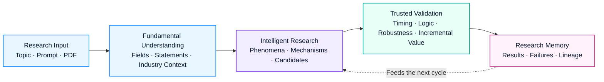
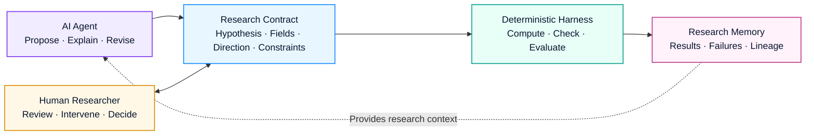
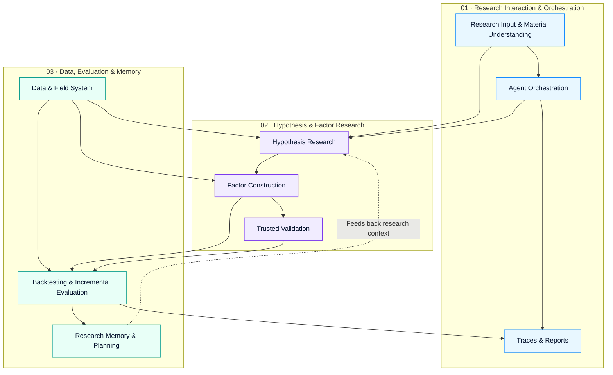
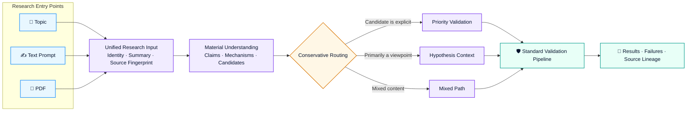
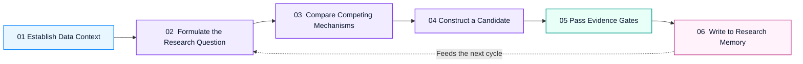
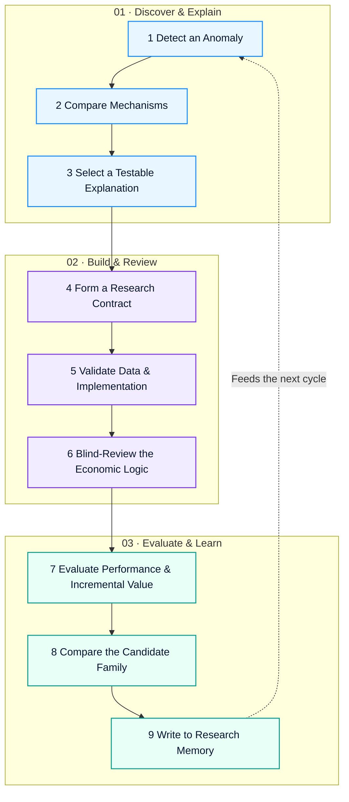
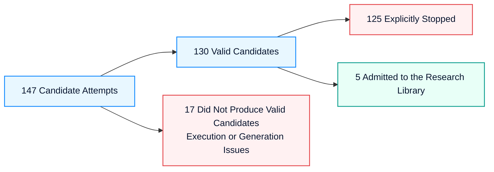

  
  

  

<h1 align="center">Loopera</h1>

  <strong>Factor Mining, Infinite Insight</strong>
   
  An intelligent agent for fundamental factor research
   
  Fundamental research, engineered for evidence.

  

  

  

  

  
  
  
  
  
  

  <a href="#product-overview">Product Overview</a> ·
  <a href="#product-framework">Product Framework</a> ·
  <a href="#pdf--prompt-research-input-framework">Research Inputs</a> ·
  <a href="#full-case-study-from-a-fundamental-observation-to-a-candidate-factor">Case Study</a> ·
  <a href="#disclaimer">Boundaries</a>

---

> **Repository scope:** This repository contains public product and technical materials for Loopera; it is not a source-code distribution. It currently provides no runnable code, installer, CLI, or public API. The workflows and case studies in this README describe product capabilities and evidence boundaries.

## Product Overview

Loopera works with public-company financial statements and operating information to help fundamental quantitative teams continuously perform **research-direction discovery, economic-hypothesis formation, candidate-factor construction, trusted validation, and knowledge accumulation**.

### Core Value

| Research | Validate | Remember | Collaborate |
| --- | --- | --- | --- |
| Find explainable phenomena in cross-statement operating relationships | Separate research logic from historical performance and filter candidates in stages | Preserve results, failure reasons, and research lineage | Let researchers review, intervene, and decide at critical checkpoints |
| Form interpretable and testable fundamental hypotheses | Check timing, accounting treatment, stability, duplication, and incremental value | Avoid repeated mistakes and continually identify research gaps | Support both small tasks and multi-role collaborative research |

### Who It Is For

- **Fundamental quantitative teams:** expand research coverage and establish a consistent, reviewable factor-research process;
- **Investment-research and fintech institutions:** connect internal reports, research views, and data capabilities to a standardized validation pipeline;
- **Research leaders:** track sources, decision rationales, failure reasons, and next steps—not just final backtest results.

 

  
   
  
    Loopera organizes research inputs, fundamental data, hypothesis discovery, factor design,
    trusted validation, and research memory into a continuously learning Agent research loop.
  

 

Its goal is not to mass-produce formulas or replace research judgment with one attractive backtest. Loopera asks whether a study has clear fundamental logic, survives multiple forms of scrutiny, and contributes information beyond existing research.

> Loopera turns fundamental research from isolated manual experiments into a continuous process that can accumulate and evolve.

## Why Start from Fundamentals

Prices reflect outcomes; fundamentals explain how a business creates, consumes, and reallocates value.

Loopera studies earnings quality, cash flow, balance-sheet structure, operating efficiency, capital investment, and changes in business conditions. Rather than looking only at market prices, it focuses on developments inside the business that may not yet be fully understood or priced.

Fundamental data is not simple. Relationships must be established across statements; the same accounting number can mean different things across industries and business stages; and the publication time of information determines whether a study could have used it in reality. Loopera brings these issues into one research process so that the Agent behaves more like a fundamental researcher than a generic curve-fitting tool.

## What Loopera Can Do

  <strong>Move from operating phenomena to trusted conclusions, then turn every study into team knowledge.</strong>
   
  Discover → Hypothesize → Build → Validate → Remember → Evolve

<table>
  <tr>
    <td width="50%" valign="top">
      <h3>🧭 Discover Research Directions</h3>
      
<strong>Start with operating anomalies, not random field combinations.</strong>

      
Search for explainable and underexplored phenomena in cross-statement relationships such as earnings versus cash flow, assets versus output, and liabilities versus operating pressure.

    </td>
    <td width="50%" valign="top">
      <h3>🧠 Form Fundamental Hypotheses</h3>
      
<strong>Explain the mechanism before constructing the factor.</strong>

      
Propose testable economic explanations, competing mechanisms, and failure conditions instead of packaging a single statistical correlation as a research conclusion.

    </td>
  </tr>
  <tr>
    <td width="50%" valign="top">
      <h3>🧩 Build Candidate Factors</h3>
      
<strong>Turn a research claim into a computable, reviewable object.</strong>

      
Map the hypothesis into a candidate construction while preserving the information used, expected direction, economic meaning, and key constraints.

    </td>
    <td width="50%" valign="top">
      <h3>🛡️ Run Trusted Validation</h3>
      
<strong>Make every candidate pass multiple evidence gates.</strong>

      
Check point-in-time availability, logical consistency, accounting treatment, robustness, duplication, and incremental value. One attractive backtest does not automatically become a conclusion.

    </td>
  </tr>
  <tr>
    <td width="50%" valign="top">
      <h3>🗂️ Accumulate Research Memory</h3>
      
<strong>Both success and failure become context for the next research cycle.</strong>

      
Record research lineage, failure reasons, untested leads, and relationships to existing results to reduce repeated mistakes.

    </td>
    <td width="50%" valign="top">
      <h3>🤝 Support Continuous Collaboration</h3>
      
<strong>The Agent expands the search space; researchers retain control of key decisions.</strong>

      
Support both rapid small-scale tasks and sustained collaboration among multiple research roles, with human review and intervention at critical checkpoints.

    </td>
  </tr>
</table>

### Three Inputs, One Research Thread

  <kbd>Topic</kbd>&nbsp;&nbsp;·&nbsp;&nbsp;<kbd>Prompt</kbd>&nbsp;&nbsp;·&nbsp;&nbsp;<kbd>PDF</kbd>
  &nbsp;&nbsp;→&nbsp;&nbsp;
  <strong>Unified Research Input</strong>
  &nbsp;&nbsp;→&nbsp;&nbsp;
  Hypotheses, factors, and validation

<strong>View input methods and processing principles</strong>

 

- **Topic:** autonomously explore themes such as cash-flow quality or operating efficiency;
- **Prompt:** focus on a specified financial relationship, economic mechanism, or applicable industry;
- **PDF:** extract research questions, economic claims, and explicit candidates while preserving provenance;
- **Mixed input:** use a Topic to add a clear research anchor to text or PDF material.

Explicit formulas in a report can be prioritized for validation; the remaining content becomes background knowledge for further exploration. External material is always treated as **research evidence to be tested** and cannot alter Loopera's safety constraints, data scope, or validation standards.

## Product Framework

  <strong>Loopera turns research intent into evidence-qualified, reusable research assets.</strong>
   
  Understand the business → Form a hypothesis → Test the evidence → Compound the knowledge

### A Closed-Loop Product Workflow

<table>
  <tr>
    <td width="25%" align="center" valign="top">
      <h3>🧱 Fundamental Understanding</h3>
      
Establish field, statement, timing, and industry context.

    </td>
    <td width="25%" align="center" valign="top">
      <h3>🧠 Intelligent Research</h3>
      
Turn operating phenomena into mechanisms and candidate directions.

    </td>
    <td width="25%" align="center" valign="top">
      <h3>🛡️ Trusted Validation</h3>
      
Move every research claim through successive evidence gates.

    </td>
    <td width="25%" align="center" valign="top">
      <h3>🗂️ Research Memory</h3>
      
Preserve results, failure reasons, and research lineage.

    </td>
  </tr>
</table>

> **The endpoint of the product loop is not a factor; it is a reviewable research asset.** Every run preserves its question, hypothesis, evidence, conclusion, and next steps.

The public version describes product capabilities and research principles only. Loopera's specific hypothesis structures, validation strategies, evaluation rules, model-collaboration mechanisms, and factor implementations are proprietary and are not disclosed here.

## Technical Framework: Hypothesis-Driven, Evidence-Gated, Memory-Augmented

  <strong>The core capability does not come from letting one model improvise; it comes from the coordination of an Agent, deterministic programs, and research memory.</strong>
   
  A research environment around the model—not a model wrapped around a backtest.

<table>
  <tr>
    <td width="33%" valign="top">
      <h3>💡 Hypothesis-driven</h3>
      
<strong>Explain first, compute second.</strong>

      
Start with an operating anomaly, compare competing mechanisms, and turn testable explanations into candidates.

      
<code>Phenomenon → Mechanism → Candidate</code>

    </td>
    <td width="34%" valign="top">
      <h3>🛡️ Evidence-gated</h3>
      
<strong>Evidence determines whether the work continues.</strong>

      
Data, timing, accounting treatment, logic, robustness, and incremental value form a sequence of gates.

      
<code>Claim → Check → Decision</code>

    </td>
    <td width="33%" valign="top">
      <h3>🧠 Memory-augmented</h3>
      
<strong>Give research durable context.</strong>

      
Preserve successes, failures, similar constructions, and unfinished leads to reduce repetition and reveal gaps.

      
<code>Trace → Memory → Next Cycle</code>

    </td>
  </tr>
</table>

### How the Three Capabilities Work Together

- **AI Agent** expands the research space by proposing, explaining, and revising ideas;
- **Research Contract** turns natural-language claims into structured objects that can be computed and reviewed;
- **Deterministic Harness** performs computation and objective checks so that narrative cannot substitute for evidence;
- **Research Memory** supplies results, failures, and lineage as context for the next cycle;
- **Human Researcher** retains review, intervention, and final decision rights at critical checkpoints.

## System Modules

  <strong>Nine modules form a three-layer architecture: the top layer handles interaction and orchestration, the middle layer performs research reasoning, and the bottom layer supplies data, evaluation, and long-term memory.</strong>
   
  Each layer can evolve independently while sharing the same structured research objects.

### Three-Layer System Architecture

<table>
  <tr>
    <th width="18%">System Layer</th>
    <th width="34%">Question It Answers</th>
    <th width="48%">Included Modules</th>
  </tr>
  <tr>
    <td><strong>🔵 Research Interaction & Orchestration</strong></td>
    <td>Where does research come from, how does collaboration work, and how is progress exposed?</td>
    <td>Research Input & Material Understanding · Agent Orchestration · Traces & Reports</td>
  </tr>
  <tr>
    <td><strong>🟣 Hypothesis & Factor Research</strong></td>
    <td>How does a phenomenon become a testable candidate?</td>
    <td>Hypothesis Research · Factor Construction · Trusted Validation</td>
  </tr>
  <tr>
    <td><strong>🟢 Data, Evaluation & Memory</strong></td>
    <td>Where does evidence come from, how is it evaluated, and how is it accumulated?</td>
    <td>Data & Field System · Backtesting & Incremental Evaluation · Research Memory & Planning</td>
  </tr>
</table>

<strong>View the responsibilities and outputs of all nine modules</strong>

 

| Module | Core Responsibility | Primary Output |
| --- | --- | --- |
| **Research Input & Material Understanding** | Accept a Topic, Prompt, or PDF and convert it into a unified, traceable research input | Material summary, claim list, formula catalog, provenance |
| **Data & Field System** | Unify financial fields, data versions, and publication times into a fundamental research panel | Standardized data, field catalog, quality information |
| **Agent Orchestration** | Coordinate a single Agent or multiple research roles and manage how a study begins, runs, and ends | Research rounds, role opinions, task state |
| **Hypothesis Research** | Propose and compare testable explanations for operating phenomena | Research themes, operating mechanisms, evidence, failure conditions |
| **Factor Construction** | Turn research hypotheses into computable candidate objects | Candidate construction, fields used, expected direction, economic interpretation |
| **Trusted Validation** | Check data, timing, accounting treatment, logic, robustness, and duplication | Check results and rejection reasons |
| **Backtesting & Incremental Evaluation** | Evaluate historical behavior consistently and test information beyond existing factors | IC, grouped performance, coverage, stability, and incremental-value summary |
| **Research Memory & Planning** | Preserve lineage, failure experience, theme crowding, and untested leads | Direction board, failure knowledge, research gaps, next-step suggestions |
| **Traces & Reports** | Organize inputs, reasoning, candidates, checks, and conclusions into readable artifacts | Research cards, run traces, candidate funnel, result reports |

> Modules connect through structured research objects. Models, data sources, and evaluation components can therefore be upgraded independently without rewriting the entire research process.

## PDF / Prompt Research Input Framework

  <strong>Different forms of research material enter the same verifiable, traceable research thread.</strong>
   
  Bring your question, your thesis, or an entire research report.

### Research Entry Points

<table>
  <tr>
    <td width="33%" align="center" valign="top">
      <h3>🎯 Topic</h3>
      
<strong>Provide a research direction</strong>

      
Let the Agent autonomously explore a theme such as cash-flow quality or operating efficiency.

    </td>
    <td width="34%" align="center" valign="top">
      <h3>✍️ Prompt</h3>
      
<strong>Express a research intent</strong>

      
Focus on a specified financial relationship, economic mechanism, industry scope, or validation priority.

    </td>
    <td width="33%" align="center" valign="top">
      <h3>📄 PDF</h3>
      
<strong>Import existing research material</strong>

      
Extract questions, claims, formulas, and constraints while preserving complete provenance.

    </td>
  </tr>
</table>

### From Material to Research Evidence

### Four Processing Stages

<table>
  <tr>
    <td width="50%" valign="top">
      <h3>① 🧬 Unify the Input</h3>
      
<strong>Every item first receives a stable identity.</strong>

      
The system records material type, topic source, content summary, and a source fingerprint. Repeated material can be linked to earlier research records.

    </td>
    <td width="50%" valign="top">
      <h3>② 🔎 Understand the Material</h3>
      
<strong>Break long-form content into researchable objects.</strong>

      
Identify research questions, economic claims, applicable scope, explicit formulas, expected direction, constraints, and data gaps.

    </td>
  </tr>
  <tr>
    <td width="50%" valign="top">
      <h3>③ 🧭 Route Conservatively</h3>
      
<strong>Not every statement in a document is treated the same way.</strong>

      
Explicit candidates enter priority validation; viewpoints become hypothesis context; mixed material is separated; definitions that cannot be closed are recorded with reasons.

    </td>
    <td width="50%" valign="top">
      <h3>④ 🧾 Preserve Source Fidelity</h3>
      
<strong>Preserve the original claim and adapt only when necessary.</strong>

      
Formula structure, window, denominator, scope, and weights are retained as source constraints. Missing key fields are never silently replaced.

    </td>
  </tr>
</table>

### Routing Outcomes

| Route | When It Applies | System Action |
| --- | --- | --- |
| ⚡ **Priority Validation** | The definition is explicit and required data is available | Convert it into a candidate and enter the standard validation pipeline |
| 🧠 **Hypothesis Context** | A viewpoint or mechanism is provided, but key choices remain unresolved | Let the Agent continue proposing and comparing explanations |
| 🔀 **Mixed Path** | Explicit candidates and background views coexist | Validate candidates first and use the remaining content for exploration |
| ⏸️ **Not Yet Supported** | Core data is missing or the definition cannot be closed | Record the reason instead of forcing a construction |

> 🛡️ **Input safety:** PDFs and Prompts can provide research evidence, but they cannot rewrite system rules, expand the data scope, or demand that validation be skipped.
>
> ✅ **One standard:** “Priority Validation” means only that a candidate can be constructed. Every candidate, regardless of source, still faces the same data, logic, accounting, historical-performance, and incremental-information checks.
>
> 🔗 **End-to-end traceability:** The final report identifies the source material, candidate-recognition outcome, necessary adaptations, blocking reasons, and final research disposition of every candidate.

<strong>View the material parsing checklist and source-adaptation principles</strong>

 

Loopera identifies the following from input material:

- the research question and background;
- the core economic claim and possible mechanisms;
- the fundamental objects involved and the applicable scope;
- explicitly proposed factors or formulas;
- expected direction, constraints, and failure conditions;
- data that may be missing, require a proxy, or remain ambiguous.

For a long PDF, the system first builds a catalog of candidate formulas so that factors explicitly stated in a table or later section are not buried by lengthy background discussion.

If the material specifies a formula structure, window, denominator, applicable scope, or weights, Loopera preserves them as source constraints. Conservative adaptation is allowed only when the material does not distinguish among standard accounting conventions, and the adopted convention is recorded in the result.

If a key field truly does not exist, the candidate is marked as data-missing or redirected into proxy research rather than silently replacing it with a superficially similar field.

## How a Research Run Works

  <strong>A research run is not “generate a formula + view a backtest.” It is an evidence-driven decision chain.</strong>
   
  Context → Question → Mechanisms → Candidate → Evidence Gates → Memory

<strong>🧭 Expand the six-stage research loop and Evidence Gates</strong>

 

### Six-Stage Research Loop

<table>
  <tr>
    <td width="50%" valign="top">
      <h3>① 🧱 Establish Data Context</h3>
      
<strong>First constrain what the Agent could have seen at the time.</strong>

      
Define financial fields, data versions, industry information, and the research period, then organize data by its actual publication time to prevent future information from entering earlier decisions.

    </td>
    <td width="50%" valign="top">
      <h3>② 🔭 Formulate the Research Question</h3>
      
<strong>Start with an operating anomaly worth explaining.</strong>

      
Ask why earnings failed to become cash, why operating liabilities diverged from business scale, or why capital spending did not produce corresponding assets—instead of combining fields at random.

    </td>
  </tr>
  <tr>
    <td width="50%" valign="top">
      <h3>③ 🧠 Compare Competing Mechanisms</h3>
      
<strong>Do not impose a single narrative on one phenomenon.</strong>

      
Retain plausible explanations such as normal settlement, active expansion, slower collections, or liquidity pressure. Continue only with mechanisms that financial evidence can distinguish.

    </td>
    <td width="50%" valign="top">
      <h3>④ 🧩 Construct a Candidate</h3>
      
<strong>Turn the hypothesis into a computable, reviewable research contract.</strong>

      
The candidate declares the information used, economic meaning, expected direction, and failure conditions. Later stages evaluate both the numbers and whether the implementation remains faithful to the original claim.

    </td>
  </tr>
  <tr>
    <td width="50%" valign="top">
      <h3>⑤ 🛡️ Validate in Stages</h3>
      
<strong>Run low-cost checks before full evaluation.</strong>

      
Data, timing, accounting treatment, logic, novelty, and historical evidence form successive gates. Any critical problem can stop the candidate.

    </td>
    <td width="50%" valign="top">
      <h3>⑥ 🗂️ Save and Continue Research</h3>
      
<strong>Both results and failures enter research memory.</strong>

      
Accepted candidates enter the research library. Rejected candidates retain their stopping point and reason, supporting deeper work, reduced repetition, or a deliberate pivot.

    </td>
  </tr>
</table>

### Evidence Gates

| Evidence Gate | Core Question | Possible Outcome |
| --- | --- | --- |
| ⚙️ **Execution & Coverage** | Does the code compute reliably, and is data coverage sufficient? | Continue / Fix / Stop |
| ⏱️ **Point-in-Time Availability** | Was the financial information genuinely available at the research timestamp? | Pass / Reject |
| 🧾 **Accounting Treatment** | Are stock, flow, cumulative values, and peer comparisons handled appropriately? | Pass / Revise |
| 🧠 **Logical Consistency** | Do the economic interpretation, implementation, and expected direction agree? | Pass / Return |
| 🧬 **Research Novelty** | Is the candidate merely a duplicate or slight variant of an existing result? | Retain / Deduplicate |
| 📈 **Performance & Incremental Value** | Does the historical evidence meet basic quality standards and add new information? | Admit / Stop |

> **Every conclusion leaves the pipeline with evidence attached.** Loopera records why the candidate was proposed, which checks it passed, where it stopped, and what the next research cycle should ask.

## What the Agent Actually Produces

Loopera's smallest deliverable is not “a factor name + a backtest curve,” but a structured research record. Based on current run artifacts, a complete output usually includes:

| Output | Question It Answers |
| --- | --- |
| Fundamental phenomenon | What anomaly was observed in the company's operations or financial relationships? |
| Research hypothesis | Why might that anomaly relate to future operations or pricing? |
| Competing mechanisms | What other plausible explanations could generate the same phenomenon? |
| Observable evidence | What cross-statement or cross-period evidence could support, weaken, or reject an explanation? |
| Candidate description | What risk or quality concept does the factor express, and what is its expected direction? |
| Quality record | Did the candidate pass data, logic, accounting, and research-consistency checks? |
| Evaluation summary | What do correlation, grouping behavior, coverage, and incremental information look like? |
| Lineage and next steps | How does it relate to existing research, and what questions remain worth testing? |

## Full Case Study: From a Fundamental Observation to a Candidate Factor

  <strong>A real research trace: from an accounting anomaly to an evidence-qualified candidate.</strong>
   
  The case summary, nine-step trace, validation results, and evidence boundaries are collapsed below.

<strong>🔎 Expand the full case: abnormal employee-compensation liabilities × weak cash realization of revenue</strong>

 

  <strong>Case question: Do abnormal employee-compensation liabilities contain cash-settlement pressure that the market has not fully understood?</strong>
   
  A real research trace—from an accounting anomaly to an evidence-qualified candidate.

<table>
  <tr>
    <td width="33%" align="center" valign="top">
      <h3>🔭 Research Question</h3>
      
Do abnormal liabilities reflect normal settlement, active expansion, or pressure on cash realization?

    </td>
    <td width="34%" align="center" valign="top">
      <h3>🧩 Candidate Concept</h3>
      
<strong>Employee-compensation liability deviation unexplained by operating scale × pressure on the cash realization of revenue</strong>

    </td>
    <td width="33%" align="center" valign="top">
      <h3>🛡️ Research Conclusion</h3>
      
The candidate passed all checks required in this round and entered the research library, but still requires out-of-sample validation.

    </td>
  </tr>
</table>

> **Disclosure:** The case logic and statistical results come from actual Agent output. To protect core technology, exact field combinations, time windows, weighting functions, outlier treatment, and internal decision parameters are not disclosed.

### Why This Is a Cross-Statement Question

Employee-compensation liabilities represent wages, bonuses, benefits, and other employee-related obligations that have been recognized but not yet paid in cash. They sit on the balance sheet, while revenue and expenses appear on the income statement, and cash payments and cash receipts from sales appear in the cash-flow statement.

The absolute liability level alone is not meaningful enough. Company size, bonus seasonality, and expansion stage all affect its normal level. The real question is: **Has the liability exceeded what business scale, industry characteristics, and the normal settlement cycle can explain?**

### Nine-Step Research Trace

<strong>Stage One · Discover & Explain: From an anomaly to a testable mechanism</strong>

 

#### ① Detect an Anomaly Worth Explaining

An earlier research round found a preliminary signal in the “deviation of employee-compensation liabilities from normal operating scale.” Instead of mechanically swapping the scaling denominator again, Loopera changed the next task to: **explain why the existing signal might relate to future performance.**

| Research Question Card | Agent Output |
| --- | --- |
| **Observed phenomenon** | Employee-related operating liabilities are high relative to revenue and peer norms |
| **Normal state** | Liabilities move with business scale and seasonal settlement, then decline in the following payment period |
| **Deviation to explain** | The elevated amount cannot be fully explained by scale, bonus cycles, or normal expansion |
| **Research question** | Does the deviation indicate future cash-payment, financing, or earnings-quality pressure? |
| **Expected direction** | If the deviation represents unabsorbed payment pressure, future performance should be relatively weaker |

#### ② Propose Competing Mechanisms

| Competing Mechanism | Fundamental Interpretation | Supporting Evidence to Observe |
| --- | --- | --- |
| **Cash-turnover pressure** | Insufficient operating cash causes employee-related payments to be delayed | Deterioration in collections, cash buffers, or financing pressure |
| **Profit-driven bonus accruals** | Improved profitability produces performance-bonus or profit-sharing accruals | Earnings improve first; liabilities rise seasonally and decline after payment |
| **Revenue recognition leads cash collection** | Revenue has been booked, but customer payments have slowed | A gap emerges between revenue and cash receipts from sales |
| **Capacity build-out and hiring lead revenue** | Facilities, equipment, and people are added before revenue is fully realized | Capital investment and construction-in-progress rise before later operating expansion |

These mechanisms can coexist. Loopera does not claim that three financial statements can prove whether a company is withholding wages. It searches for public evidence that raises or lowers the credibility of a particular explanation.

#### ③ Select a Testable Mechanism

This round tests the mechanism that “revenue recognition leads cash collection.” Revenue on the income statement and cash receipts from sales on the cash-flow statement describe the same operating process from different angles. If revenue remains present while cash inflow weakens, the abnormal accumulation is more likely to relate to cash-realization pressure rather than scale alone.

> **Public conceptual expression: employee-compensation liability deviation unexplained by operating scale × pressure on the cash realization of revenue**

This is not a production formula. The actual construction also contains time alignment, accounting-basis conversion, industry comparability, missing-value treatment, and robustness steps.

<strong>Stage Two · Build & Review: Turn the research claim into a trusted candidate</strong>

 

#### ④ Form a Computable Research Contract

| Declaration | Content |
| --- | --- |
| **Information used** | Public financial information from the balance sheet, income statement, and cash-flow statement |
| **Economic meaning** | Identify abnormal employee-compensation liabilities outside normal operating relationships and accompanied by weak cash realization |
| **Expected direction** | Greater pressure may imply greater pressure on future operating and market performance |
| **Failure conditions** | Bonus seasonality, advance receipts, settlement timing, business-model differences, and active expansion may cause false positives |

The code implementation is bound to these declarations. Even if historical performance looks strong, a candidate is rejected or the research claim must be revised when the code actually measures something else.

#### ⑤ Validate Data and Implementation

- Validate effective financial observations, research-panel coverage, and consistency across historical information snapshots;
- Introduce new cross-statement mechanism information relative to earlier attempts rather than merely replacing a denominator;
- Handle stock liabilities, period revenue, and cumulative cash flows according to their appropriate accounting treatment.

#### ⑥ Review the Logic Without Seeing Backtest Results

An independent reviewer reads only the research hypothesis, field definitions, and candidate implementation—not backtest returns. The candidate continued after economic-logic review, subject to the following limitations:

- Low cash receipts from sales relative to revenue is more accurately described as weak cash realization, not customer default;
- Bonus accrual and payment are seasonal; peer comparison can mitigate but not eliminate the issue;
- Industry classifications do not necessarily imply identical business models, so peer benchmarks may remain too coarse;
- A single-period cash-realization measure can be affected by advance receipts, cross-period settlement, and a small denominator;
- Current evidence supports risk-state identification but is insufficient to determine specific payment behavior by a company.

<strong>Stage Three · Evaluate & Learn: Decide whether to admit the candidate and what to study next</strong>

 

#### ⑦ Evaluate Historical Performance and Incremental Value

The candidate enters full research evaluation only after passing logical review. Because the public materials do not simultaneously disclose a reproducible sample period, universe, rebalancing rules, costs, and turnover assumptions, this README does not display specific performance figures.

#### ⑧ Compare Other Candidates in the Same Family

This research family retains **7 related attempts**. **2 entered the research library**, while **5 stopped at different stages**:

- The first base construction was returned because the stated research idea and implementation did not align; it passed only after revision;
- A variant intended to remove expansion effects did not receive support in early data checks;
- A rewritten version showed preliminary performance but failed to demonstrate incremental value beyond existing results;
- Other liquidity-conditioned variants did not provide sufficient evidence.

Confirming a theme does not mean accepting every formula within it. Each branch must independently explain which mechanism it tests, whether it remains faithful to the original hypothesis, and whether it genuinely adds information.

#### ⑨ Write to Research Memory

The system preserves more than the factor panel. It also records the source phenomenon and mechanism branch, where sibling constructions failed, seasonality and proxy risks raised by reviewers, how crowded the direction has become, and the out-of-sample, stability, and finer-grained fundamental validation required next.

When the Agent later studies a related topic, this material re-enters context so that the work does not restart from the same simple ratio.

### Public Evidence Boundary

The README discloses only the research question, mechanisms, validation process, and conclusion boundaries. Until a complete methodology is published, it does not present weak metrics such as Rank IC, Sharpe ratio, annualized return, drawdown, or coverage that could be misread as product performance.

### What the Evidence Supports

<table>
  <tr>
    <td width="50%" valign="top">
      <h3>✅ Currently Supported</h3>
      
When employee-related operating liabilities deviate materially from normal operating relationships while revenue also shows weak cash realization, the combined state contains some incremental information in the historical sample.

    </td>
    <td width="50%" valign="top">
      <h3>🚫 Not Currently Supported</h3>
      
The evidence cannot confirm that a company is withholding wages, nor can it establish out-of-sample profitability or justify direct trading use.

    </td>
  </tr>
</table>

> **A complete deliverable is not a formula.** It is a research question, multiple competing mechanisms, an executable candidate, a layered body of validation evidence, a conclusion with explicit limitations, and research memory that the next cycle can reuse.

## Core Characteristics

<table>
  <tr>
    <td width="33%" valign="top">
      <h3>🧱 Fundamentals First</h3>
      
Start from business operations and cross-statement relationships rather than observing price outcomes first and inventing an explanation afterward.

    </td>
    <td width="34%" valign="top">
      <h3>⚖️ Separate Logic from Results</h3>
      
Judge whether the explanation is sound independently from whether historical data supports it, reducing the risk of reverse-engineering a narrative from attractive results.

    </td>
    <td width="33%" valign="top">
      <h3>🧬 Focus on Incremental Information</h3>
      
A candidate that performs well but closely resembles an existing factor does not automatically become a new research result.

    </td>
  </tr>
  <tr>
    <td width="33%" valign="top">
      <h3>🧾 End-to-End Traceability</h3>
      
Record sources, hypotheses, validation, decisions, and stopping reasons so that every conclusion can be reviewed.

    </td>
    <td width="34%" valign="top">
      <h3>🔁 Learn from Failure</h3>
      
Failures are research assets used to reduce repeated mistakes and reveal areas that remain underexplored.

    </td>
    <td width="33%" valign="top">
      <h3>🤝 Human-Agent Collaboration</h3>
      
The Agent expands exploration and organizes evidence; professional research teams retain critical review and final decision authority.

    </td>
  </tr>
</table>

## Current Research Output

  <strong>147 candidate attempts · 66 structured hypotheses · 37 research patterns · 5 candidates admitted to the research library</strong>
   
  The complete candidate funnel, research coverage, and independent Agent evaluation are collapsed below.

<strong>📊 Expand current research output and evaluation results</strong>

 

  <strong>The following internal research-run snapshot illustrates what the Framework has actually produced.</strong>
   
  These numbers describe research activity—not investable signals.

<table>
  <tr>
    <td width="25%" align="center"><h3>147</h3>
Candidate Attempts
</td>
    <td width="25%" align="center"><h3>66</h3>
Structured Hypotheses
</td>
    <td width="25%" align="center"><h3>37</h3>
Research Patterns
</td>
    <td width="25%" align="center"><h3>5</h3>
Admitted to the Research Library
</td>
  </tr>
</table>

### Candidate Funnel

Roughly two-thirds of attempts stopped during economic-logic review or early signal screening. The system's primary job is not to admit as many candidates as possible, but to eliminate ideas with weak explanations or insufficient evidence early.

| Primary Stopping Point | Attempts | Typical Reason |
| --- | ---: | --- |
| Research logic and economic consistency | **52** | Narrative and implementation disagree, proxy interpretation is too strong, or direction/accounting meaning is problematic |
| Early signal screening | **45** | Basic historical evidence is insufficient, so full evaluation cost is not incurred |
| Data coverage and panel quality | **11** | Too few usable companies, insufficient cross-sectional differentiation, or unstable data state |
| Duplication with historical research | **9** | Too similar to earlier attempts and adds no substantive information |
| Full performance and incremental evaluation | **7** | Preliminary signal exists but does not meet final quality or incremental-value requirements |
| Execution and timing checks | **3** | Computation fails, is unstable, or uses data at an invalid time |

### Research Coverage

<table>
  <tr>
    <td width="50%">💵 Quality of earnings-to-operating-cash-flow conversion</td>
    <td width="50%">📦 Customer collections, inventory, and working-capital usage</td>
  </tr>
  <tr>
    <td>🏗️ Alignment between capital expenditure and asset formation</td>
    <td>👥 Operating liabilities and employee-compensation settlement pressure</td>
  </tr>
  <tr>
    <td>📈 Alignment between administrative expenses and business expansion</td>
    <td>🧾 Abnormal use of prepayments and other receivables</td>
  </tr>
  <tr>
    <td>🤝 Supplier credit and changes in procurement settlement</td>
    <td>♻️ Sustainability of investment income</td>
  </tr>
</table>

These themes reflect Loopera's fundamental orientation: the research object is not an isolated financial ratio, but an operating relationship that should hold across statements and may have begun to diverge.

### What Characterizes Admitted Candidates

The current **5 admitted candidates** are concentrated in the “abnormal operating liabilities” research thread. This suggests that the Agent found a phenomenon worth deepening, while also showing that research diversity remains limited at this stage.

<table>
  <tr>
    <td width="50%" valign="top">
      <h3>⚠️ Abnormal-Burden Candidates</h3>
      
Assess whether an operating liability materially exceeds the normal range explained by revenue, costs, or peer operating conditions.

    </td>
    <td width="50%" valign="top">
      <h3>🔎 Mechanism-Differentiation Candidates</h3>
      
Combine cross-statement evidence such as cash realization and capital investment to distinguish normal expansion or settlement timing from potential cash pressure.

    </td>
  </tr>
</table>

The public page does not disclose field combinations, production formulas, or performance ranges for admitted candidates. Public information focuses on the research process, traceable evidence, and explicit capability boundaries.

### Independent Evaluation of Agent Capability

We also evaluate the Agent's discovery ability and false-discovery risk in simulated environments where the true answer is known, rather than relying only on historical market results whose ground truth cannot be confirmed.

<table>
  <tr>
    <td width="50%" valign="top">
      <h3>✅ Capabilities Already Demonstrated</h3>
      <ul>
        <li>It can identify some traditional linear fundamental information;</li>
        <li>The data-understanding, hypothesis-generation, factor-construction, and evaluation chain is operational;</li>
        <li>In a no-signal environment, the full validation process filtered out final candidates created by chance significance.</li>
      </ul>
    </td>
    <td width="50%" valign="top">
      <h3>🧭 Capabilities That Still Need Improvement</h3>
      <ul>
        <li>Autonomous discovery of interactions, state dependence, and complex nonlinear relationships remains limited;</li>
        <li>The Agent is susceptible to examples and common formulations in prompts;</li>
        <li>More data and more attempts do not automatically produce more truthful discoveries; stopping rules, diversity, and independent evaluation remain essential.</li>
      </ul>
    </td>
  </tr>
</table>

> Across real runs and simulation experiments, Loopera is already an operational, verifiable, and cumulative fundamental-research Framework. Its clearest value today is expanding research coverage, standardizing the research process, and preserving reviewable evidence—not promising the automatic discovery of stable Alpha.

## Use Cases

<table>
  <tr>
    <td width="33%" align="center">🧭 <strong>Expand Research Directions</strong> Find fundamental phenomena worth explaining</td>
    <td width="34%" align="center">🧩 <strong>Validate Factor Ideas</strong> Turn economic hypotheses into candidates and screen them</td>
    <td width="33%" align="center">🧬 <strong>Check Incremental Value</strong> Identify duplicate constructions and new information</td>
  </tr>
  <tr>
    <td align="center">🧾 <strong>Standardize Research</strong> Unify the evidence chain and preserve a complete trace</td>
    <td align="center">🎓 <strong>Assist Researchers</strong> Provide scaffolding for fundamental research</td>
    <td align="center">🧪 <strong>Evaluate Agents Under Control</strong> Measure discovery capability and false-discovery risk</td>
  </tr>
</table>

## Disclaimer

<table>
  <tr>
    <td width="33%" valign="top">
      <h3>🚫 Not Investment Advice</h3>
      
Loopera does not promise returns and does not replace data licensing, compliance review, or investment decisions.

    </td>
    <td width="34%" valign="top">
      <h3>🚫 Not a Fact Generator</h3>
      
Language-model output is never treated directly as fact. Every claim requires evidence.

    </td>
    <td width="33%" valign="top">
      <h3>🚫 Not One-Click Alpha</h3>
      
One historically significant result is not an effective factor. Independent research and risk assessment are still required before formal use.

    </td>
  </tr>
</table>

## Public Disclosure Scope

<table>
  <tr>
    <th width="50%">✅ Public in This Repository</th>
    <th width="50%">🔒 Not Publicly Disclosed</th>
  </tr>
  <tr>
    <td valign="top">
      <ul>
        <li>Product framework and research principles</li>
        <li>Aggregated experimental conclusions</li>
        <li>Case explanations that do not reveal core constructions</li>
      </ul>
    </td>
    <td valign="top">
      <ul>
        <li>Unauthorized raw data and data snapshots</li>
        <li>Specific candidate-factor implementations and trading use</li>
        <li>Internal evaluation rules, parameters, and research strategies</li>
        <li>Proprietary Agent collaboration, hypothesis-evolution, and validation mechanisms</li>
        <li>Keys, service configuration, and run records containing sensitive context</li>
      </ul>
    </td>
  </tr>
</table>

<!--## License and Use

This repository uses the [Business Source License 1.1](./LICENSE) (BSL 1.1), which is **not an OSI-approved open-source license**. The current Additional Use Grant is `None`, so only the non-production use described in the license text is permitted. On 2030-09-09, or an earlier date specified by the license, the corresponding version will convert to Apache License 2.0. GitHub showing `Other / NOASSERTION` is expected for this type of license. This repository does not describe its current licensing status as “open source.” For commercial, production, or contractual use, contact Loopera through the details published on the [Loopera website](https://loopera.cn/) to confirm licensing terms, the contracting entity, and data rights. Third-party components and data are not relicensed by this repository's LICENSE.-->

---

<h2 align="center">Make Fundamental Research Compound</h2>

  <strong>Start with a question worth explaining, and make every research cycle the foundation for the next.</strong>

  
  
  

  Loopera is intended for research and technical evaluation. It is not investment advice and does not promise future returns.

